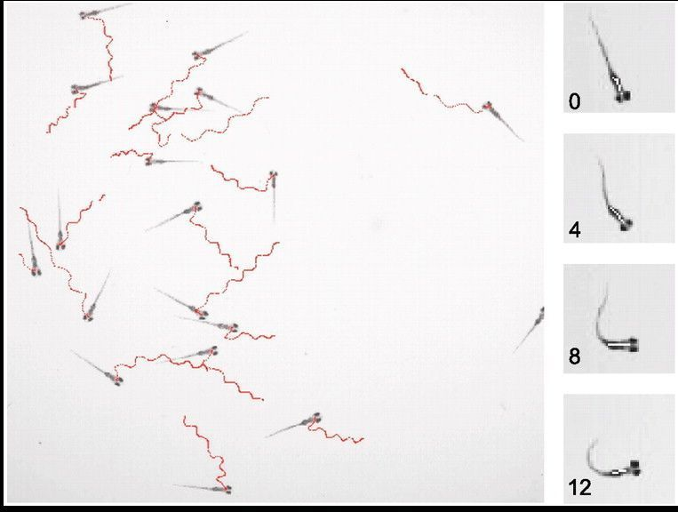
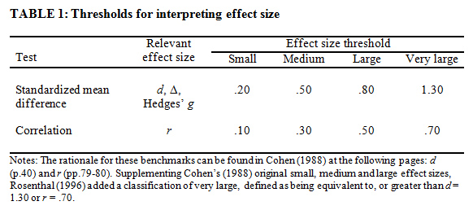

```{r setup, include=FALSE}
knitr::opts_chunk$set(echo = FALSE)
```

## The experiment 

### C-Bend During Zebrafish Larvae Startle Response:
<font size="3"> Sterotyped behavior following an acoustic stimulus (shown: zebrafish larvae 7 days past fertilization) </font>
{width=75%} 
 <font size="1"> (Burgess and Granato, 1997)  </font>

## Autism Spectrum Disorder Genetic Screen in Zebrafish

CRISPR knockout Zebrafish with mutations associated with Autism Spectrum Disorder

Categorize genes by shared behavioral phenotypes and brain morphology

<font size="4"> This R project focused on Short Latency C-Starts (SLCs), a good indicator of startle susceptability </font> 

## Loading in and cleaning the data  {.build}

```{r eval=FALSE, echo=TRUE, tidy=TRUE} 
files <- dir('K:/5_brainscan_data', recursive=TRUE, 
             full.names=T, pattern = 'c1_analysis.trk') 
            #Look through all subdirectories for specific file


dats <- lapply(files, read.table, fill = TRUE, 
               skip = 1, header = TRUE) #all data frames for particular stimulus


dats_combined$genotype <-
  str_replace(dats_combined$genotype, "knd", "mut")
#replacing any incorrect factor names 
```

```{r eval=FALSE}
#all other code for data munging 

library(rio)
library(tidyverse)
library(rlist)
library(effsize)

#end goal is to create graphs for all genes, cluster the results from all experiments to find similarities in SLC responsiveness 


files <- dir('K:/5_brainscan_data', recursive=TRUE, full.names=T, pattern = 'c1_analysis.trk') #Don't want all c1_analysis files from all subdirectories...


files <- files[grepl("SetA", files)] #extract all items from list which contain string 
dats <- lapply(files, read.table, fill = TRUE, skip = 1, header = TRUE) #all data frames for hi stim

dats_combined <- bind_rows(dats, .id = 'Gene_name')


dats_combined <- dats_combined %>% separate(File, c("track", "gene", "genotype", "fish#"), sep = "_")
dats_combined$track <- NULL
dats_combined$Gene_name <- NULL
dats_combined <- dats_combined[-c(1:81),]

  
dats_combined <- dats_combined %>%
  mutate(genotype = substr(dats_combined$genotype, 1, nchar(dats_combined$genotype)-3)) #remove group numbers from genotype

dats_combined$genotype <- dats_combined$genotype %>% str_replace("m(?!u)", "mut") %>% str_replace("w", "con")

dats_combined$genotype <- str_replace(dats_combined$genotype, "knd", "mut") #replacing any incorrect factor names 

gene_list <- split(dats_combined, dats_combined$gene)

gene_list[["trip12"]][["genotype"]] <- str_replace(gene_list[["trip12"]][["genotype"]], "mun", "mut") #fixing somebody's weird typo  
names(gene_list)[29] <- "tlk2" #fixing incorrectly named gene 
```


## Statistics 

```{r eval=FALSE, echo=TRUE, tidy=TRUE} 
n <- 1
for (d in gene_list){
cohen_d_all_genes[n,"gene"] = ( names(gene_list[n])) 
cohen_d <- cohen.d.default(gene_list[[n]][["SLC"]], 
           gene_list[[n]][["genotype"]], na.rm = TRUE)
cohen_d_all_genes[n,"d"] = cohen_d$estimate
n = n + 1
} # A for loop that calculates all Cohen's d values for each mutant 


cohen_d_all_genes$category <- cut(cohen_d_all_genes\$d, 
           c(0,0.2,0.5,0.8,1.30)) #make cutoff categories

levels(cohen_d_all_genes$category) <- 
  c("very small", "small", "medium", "large", "very large") #and rename them in plain English

```

```{r eval=FALSE}
#all stats-related code 

cohen_d_all_genes <- data.frame("gene","d", stringsAsFactors = FALSE) 
colnames(cohen_d_all_genes) <- as.character(unlist(cohen_d_all_genes[1,]))
cohen_d_all_genes = cohen_d_all_genes[-1, ]


n <- 1
for (d in gene_list){
cohen_d_all_genes[n,"gene"] = ( names(gene_list[n])) 
cohen_d <- cohen.d.default(gene_list[[n]][["SLC"]], gene_list[[n]][["genotype"]], na.rm = TRUE)
cohen_d_all_genes[n,"d"] = cohen_d$estimate
n = n + 1
} 


cohen_d_all_genes$d <- as.numeric(cohen_d_all_genes$d) %>% round(3) 
cohen_d_all_genes$d <- abs(cohen_d_all_genes$d) #change negative values to positive
cohen_d_all_genes <- cohen_d_all_genes[with(cohen_d_all_genes, order(cohen_d_all_genes$d)),]
cohen_d_all_genes$category <- c(NA)
cohen_d_all_genes$category <- cut(cohen_d_all_genes$d, c(0,0.2,0.5,0.8,1.30)) #make cutoff categories

#sort by cohen's d value

levels(cohen_d_all_genes$category) <- c("very small", "small", "medium", "large", "very large")


cohen_d_all_genes$gene = with(cohen_d_all_genes, reorder(gene, d)) #change factor levels to that genes are sorted by d value in ggplot

```


##  Plotting 

{width=60%}
{width=35%} 
 
 <font size="1"> Ellis, P.D. (2009) </font>
 
 
```{r eval=FALSE}
plot <- ggplot(
  data = cohen_d_all_genes,
  mapping = aes(
    x = d,
    y = gene,
    color = factor(category)
  )
) +
  geom_point() + 
  theme_classic() + 
  labs(title = "Comparing SLC Responsiveness in ASD Gene CRISPR Knockouts",  
           x = "Cohen's D Value (Control vs Knockdown)", y = "ASD Gene") +  #show thresholds that determined size category  
  theme(plot.title = element_text(size = 12)) 
 


plot$labels$colour <- "Effect Size"
```
 
# Thanks for listening  