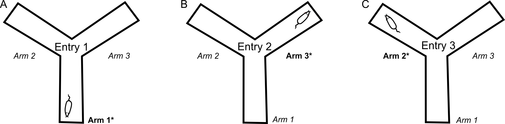

```{r setup, include=FALSE}
knitr::opts_chunk$set(echo = TRUE)
```
## Introduction
The Sponataneous Alternation Y Maze is a behavioral assay used to study spatial working memory in mice. The task consists of a 5 minute exploratory phase in which the mouse can freely move about the Y-shaped apparatus. Tracking is done using a digital video camera and ANYMaze Behavioral Tracking Software. 


The pattern in which a mouse walks (Starting in Arm 1 and moving to either Arm 2 or 3) is tracked and analyzed using the R script depicted here. A sequence counts as an "Alternation" if 3 unique arms are entered (i.e. Arm1 --> Arm2 --> Arm 3), based on overlapping triplets. If a mouse leaves an arm, returns to the same arm, then leaves to a unique arm, an alternation is also accounted for.  


For exmaple, the pattern

**132132313221**

contains 7 Alternations: 132 321 213 132 231 132 3221

```{r, echo = FALSE}

```
*Image courtesy of Prieur et al (2019)*

We want to see if the mouse's "Percent Alternation" performace is above/below chance, indicating its choice for/against a novel arm and revealing their spatial working memory. The percent alternation is calculated by the 

(total number of alternations)/(number of arms entered) × 100%

for each mouse. 

## Import Data
```{r message=FALSE, warning=FALSE}
##install.packages('tidyverse')
library (tidyverse)
##install.packages('ggplot2')
library (ggplot2)
#install.packages('dplyr')
library(dplyr)
##install.packages('rio')
library (rio)

## load csv files - the input file name has to be updates each time and the file needs to be in the same project folder as the code
data <- read_csv("102819 YMaze_SA Cyt1 flfl Data_Seq.csv",)
head(data)
```
## Tidying
```{r}
n<-nrow(data)

for (i in 1:n){
  animali<- data[i,]
  animali<- animali %>% 
    select ('Visited zones', contains("X"))  %>% 
    gather(variable, sequence) %>% select(sequence) %>% 
    filter(sequence !=('Center'))
  animali<-animali %>% 
    mutate (onebefore= lag(sequence)) %>% 
    mutate (twobefore=lag(onebefore)) %>% 
    mutate(threebefore=lag(twobefore)) %>% 
    mutate (alternation1= ifelse(sequence=='Arm 1'& onebefore=='Arm 2' & twobefore=='Arm 3',1,0)) %>% 
    mutate (alternation2= ifelse(sequence=='Arm 1'& onebefore=='Arm 3' & twobefore=='Arm 2',1,0)) %>% 
    mutate (alternation3= ifelse(sequence=='Arm 2'& onebefore=='Arm 3' & twobefore=='Arm 1',1,0)) %>% 
    mutate (alternation4= ifelse(sequence=='Arm 2'& onebefore=='Arm 1' & twobefore=='Arm 3',1,0)) %>% 
    mutate (alternation5= ifelse(sequence=='Arm 3'& onebefore=='Arm 1' & twobefore=='Arm 2',1,0)) %>% 
    mutate (alternation6= ifelse(sequence=='Arm 3'& onebefore=='Arm 2' & twobefore=='Arm 1',1,0)) %>% 
    mutate (alternation7= ifelse(sequence=='Arm 1'& onebefore=='Arm 2' & twobefore=='Arm 2' & threebefore=='Arm 3',1,0)) %>% 
    mutate (alternation8= ifelse(sequence=='Arm 1'& onebefore=='Arm 3' & twobefore=='Arm 3' & threebefore=='Arm 2',1,0)) %>% 
    mutate (alternation9= ifelse(sequence=='Arm 2'& onebefore=='Arm 1' & twobefore=='Arm 1' & threebefore=='Arm 3',1,0)) %>% 
    mutate (alternation10= ifelse(sequence=='Arm 2'& onebefore=='Arm 3' & twobefore=='Arm 3' & threebefore=='Arm 1',1,0)) %>% 
    mutate (alternation11= ifelse(sequence=='Arm 3'& onebefore=='Arm 2' & twobefore=='Arm 2' & threebefore=='Arm 1',1,0)) %>% 
    mutate (alternation12= ifelse(sequence=='Arm 3'& onebefore=='Arm 1' & twobefore=='Arm 1' & threebefore=='Arm 2',1,0)) %>%   
    mutate(A1=as.numeric(alternation1)) %>% 
    mutate(A2=as.numeric(alternation2)) %>% 
    mutate(A3=as.numeric(alternation3)) %>% 
    mutate(A4=as.numeric(alternation4)) %>% 
    mutate(A5=as.numeric(alternation5)) %>% 
    mutate(A6=as.numeric(alternation6)) %>% 
    mutate(A7=as.numeric(alternation7)) %>% 
    mutate(A8=as.numeric(alternation8)) %>% 
    mutate(A9=as.numeric(alternation9)) %>% 
    mutate(A10=as.numeric(alternation10)) %>% 
    mutate(A11=as.numeric(alternation11)) %>% 
    mutate(A12=as.numeric(alternation12)) %>% 
    mutate(alternation=A1+A2+A3+A4+A5+A6+A7+A8+A9+A10+A11+A12) %>% 
    select(sequence, onebefore, twobefore, threebefore, alternation)
   
  animali<-animali[-c(1,2),]

  a<-sum(animali$alternation, na.rm=T)
  #a
  entries<-nrow(animali)
  #entries
  percentage<-a/entries *100
  #as.numeric(percentage)
  ci<-c(data$Animal[i], data$Treatment[i], data$Distance[i], entries, percentage)
  if (i==1) {final<-rbind(ci)} else {final<-rbind(final,ci)}
}

colnames(final)<-c('Animal','Treatment','Distance','Entries','Alternation')
final<-as.data.frame(final)
final<-final %>% arrange(Animal)
final
```

```{r}
write.csv(final, file="BIOF339 FINAL PROJECT_Ymaze Cyt1 flfl_tidy.csv")
```


## Statistical Analysis
```{r}
final2 <- final %>% mutate(Treatment=toupper(Treatment)) %>%
  mutate(Treatment=as.factor(Treatment)) %>%
  mutate(Alternation=as.numeric(as.character(Alternation))) %>%
  mutate(Distance=as.numeric(as.character(Distance))) %>%
  mutate(Animal=as.character(Animal)) %>%
  mutate(Entries=as.numeric(as.character(Entries)))

str(final2)
YMAze_ttest <- t.test(Alternation~Treatment, data=final2) %>% 
  broom::tidy()
print(YMAze_ttest)

Distance_ttest <- t.test(Distance~Treatment, data=final2) %>% 
  broom::tidy()
print(Distance_ttest)

```

## Graphs
```{r}
sem <- function(x) sqrt(var(x, na.rm=T)/sum(!is.na(x)))
plot_data <- final2 %>% 
  group_by(Treatment) %>% 
  summarise(meanAlt = mean(Alternation), semAlt=sem(Alternation))
plot_data

ttest_plot <-  ggplot(data = plot_data,
                      mapping = aes(x = Treatment, y=meanAlt, fill=Treatment)) +
  geom_col()+
  labs(x= "Treatment", y= "Percent Alternation", title= "YMAze Spontaneous Alternation Percentage") +
  geom_errorbar(aes(ymin=meanAlt - semAlt, ymax= meanAlt+semAlt)) +
  ylim(0,70)

ttest_plot <- ttest_plot + 
  geom_point(data=final2, mapping = aes(x=Treatment, y=Alternation,
                                        group=Treatment), show.legend = FALSE)
print(ttest_plot)

plot_data_dist <- final2 %>% 
        group_by(Treatment) %>% 
        summarise(meanDist = mean(Distance), semDist=sem(Distance))
plot_data_dist

distance_plot <-plot_data_dist %>% 
  ggplot(mapping=aes(x=Treatment, y=meanDist, fill=Treatment))+
  geom_col()+
  labs(x="Treatment", y="Average Distance (m)", title="Average Distance Travelled by Group")+
  geom_errorbar(aes(ymin=meanDist - semDist, ymax= meanDist+semDist))

distance_plot <- distance_plot + geom_point(data=final2, 
                                            mapping = aes(x=Treatment, y=Distance,
                                                          group=Treatment),
                                            show.legend = FALSE)
print(distance_plot)

```

## Conclusion
Overall, we found no significant difference between our control vs Cre injected floxed mice for both their percent alternation and total distance travelled. Therefore, we can conclude that removing the Cyt1 domain in these mice has no impact on their spatial working memory. 

## Citations
Prieur, E. A. and Jadavji, N. M. (2019). Assessing Spatial Working Memory Using the Spontaneous Alternation Y-maze Test in Aged Male Mice. Bio-protocol 9(3): e3162. DOI: 10.21769/BioProtoc.3162.