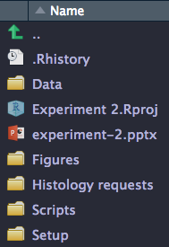

```{r setup, include = FALSE}
knitr::opts_chunk$set(echo = TRUE, message = FALSE, warning = FALSE)
```


## Introduction and experimental design
+ I work with animal models of breast cancer and conducted an experiment where I treated tumor-bearing mice with the CDK4/6 inhibitor, palbociclib.
+ The dose-limiting toxicity of palbociclib is decreased white blood cell counts, so part of my experiment involved measuring the complete blood count and leukocyte differential of mice after treatment.


## Project setup
+ First I loaded libraries, functions, and set my working directory.

```{r}
library(tidyverse)
library(rio)
library(broom)
library(visdat)
library(plotly)
setwd("~/Downloads/Gallanis_BIOF339_final")
source("gregtheme.R") # a custom ggplot theme to match my other plots
```

<div style="float: left; width: 50%;">
+ I integrated my R project files into my animal experiment folder for good housekeeping. (For this presentation all the files load from the downloads folder.)
</div>

<div style="float: right; width: 50%;">

</div>


## Data import
+ Then, I imported the data, which I had previously transcribed into Excel.
```{r}
CBC_raw <- import("Mouse_CBCs.csv")
trt <- import("Exp_2_groups.csv")
```

---
```{r}
str(CBC_raw)
```

---
```{r}
str(trt)
```


## Data reformatting and joining
+ I adjusted the data formats, removed extraneous information such as the reference ranges, and merged the measurements with the treatment group annotations.

```{r}
trt <- trt %>% mutate(
  No = as.character(No),
  Group = as.factor(Group),
  Treatment = as.factor(Treatment))

CBC <- CBC_raw %>% slice(-c(1,2)) %>% full_join(trt, by = "No") %>% arrange(No) 
CBC <- CBC[,c(1,21,20,2:19)]
```

---
```{r}
str(CBC)
```

---
```{r, out.width = "50%", fig.show = "hold", fig.cap = "Left: Before processing. Right = After processing and joining"}
vis_dat(CBC_raw)
vis_dat(CBC)
```


## Taking a preliminary look
+ First I sought to take a look at the plot of all the data

```{r, eval = FALSE}
liveplot <- CBC %>% gather(Measurement, Value, names(select_if(.,is.numeric)))  %>%
  ggplot() +
  geom_jitter(aes(x = Treatment, y = Value, color = Treatment),width = 0.2, height = 0.1) +
  facet_wrap(~ Measurement, scales = "free") +
  xlab("Treatment") +
  ylab("Values (mean ± SD)") +
  ggtitle("Mouse CBC values by treatment")

ggplotly(liveplot, tooltip = c("x","y","label"))
```


## Preliminary look {#prelim}
<style> #prelim { 
    margin-top: -50px; 
  } 
</style>

```{r, echo = FALSE, fig.width = 10, fig.height = 6}
liveplot <- CBC %>% gather(Measurement, Value, names(select_if(.,is.numeric)))  %>%
  ggplot() +
  geom_jitter(aes(x = Treatment, y = Value, color = Treatment, label = No),width = 0.2, height = 0.1) +
  facet_wrap(~ Measurement, scales = "free") +
  xlab("Treatment") +
  ylab("Values (mean ± SD)") +
  ggtitle("Mouse CBC values by treatment")

ggplotly(liveplot, tooltip = c("x","y","label"))
```


## Summary statistics and analyses
+ Next, I calculated mean and standard deviation of the measurements for each CBC parameter, grouped by treatment. 
+ I also performed t tests to compare the means from palbocicilb-treated samples to vehicle-treated samples for each CBC parameter.

```{r}
CBC_summary <- CBC %>%
  gather(Measurement, Value, names(select_if(.,is.numeric))) %>% 
  group_by(Treatment, Measurement) %>% 
  summarize_at("Value",list(mean = mean, sd = sd)) %>% 
  arrange(Measurement)

CBC_ttest <- CBC %>% 
  select_if(is.numeric) %>%
  sapply(function(i) t.test(i ~ CBC$Treatment, alternative = "two.sided")$p.value) %>% 
  tidy %>%
  data.frame %>% 
  rename(Measurement = names, two_sided_p_val = x)
```

---
<div style="float: left; width: 50%;">
```{r}
head(CBC_summary)
```
</div>

<div style="float: right; width: 50%;">
```{r}
CBC_ttest
```
</div>


## Adding annotations based on t test results
+ I created a small data frame containing the annotations and coordinates for drawing comparison lines
```{r}
annotations <- data.frame(Measurement = c("PLT_(10^9/L)","PCT_%"),
                          x1 = c(1,1), x2 = c(2,2), 
                          y1 = c(625,0.6), y2 = c(650,0.64), 
                          xlab = c(1.5,1.5), ylab = c(670,0.67), 
                          lab = c("**","**"))
```


```{r, echo = FALSE}
annotations
```


## Putting it all together
```{r, eval = FALSE}
finalplot <- CBC %>% gather(Measurement, Value, names(select_if(.,is.numeric)))  %>%
  ggplot() +
  geom_jitter(aes(x = Treatment, y = Value, color = Treatment),width = 0.2, height = 0.1) +
  geom_errorbar(aes(x = Treatment, ymax = mean+sd, ymin = mean-sd, color = Treatment), 
                width = 0.1, data = CBC_summary, inherit.aes = FALSE, show.legend = FALSE) +
  geom_errorbar(aes(x = Treatment, ymax = mean, ymin = mean, color = Treatment), 
                width = 0.2, data = CBC_summary, inherit.aes = FALSE, show.legend = FALSE) +
  geom_text(data = annotations, aes(x = xlab, y = ylab, label = lab)) +
  geom_segment(data = annotations, aes(x = x1, xend = x1, y = y1, yend = y2)) +
  geom_segment(data = annotations, aes(x = x2, xend = x2, y = y1, yend = y2)) +
  geom_segment(data = annotations, aes(x = x1, xend = x2, y = y2, yend = y2)) +
  scale_color_manual(values=c("#EB4478","#000000")) +
  scale_y_continuous(expand = c(.1,.1)) +
  facet_wrap(~ Measurement, scales = "free") +
  xlab("Treatment") +
  ylab("Values (mean ± SD)") +
  ggtitle("Mouse CBC values by treatment") +
  gregtheme()

finalplot
```


## Putting it all together {#finalplot}
<style> #finalplot > p { 
    margin-top: -50px; 
  } 
</style>

```{r, echo = FALSE, fig.width = 10, fig.height = 6}
finalplot <- CBC %>% gather(Measurement, Value, names(select_if(.,is.numeric)))  %>%
  ggplot() +
  geom_jitter(aes(x = Treatment, y = Value, color = Treatment),width = 0.2, height = 0.1) +
  geom_errorbar(aes(x = Treatment, ymax = mean+sd, ymin = mean-sd, color = Treatment), 
                width = 0.1, data = CBC_summary, inherit.aes = FALSE, show.legend = FALSE) +
  geom_errorbar(aes(x = Treatment, ymax = mean, ymin = mean, color = Treatment), 
                width = 0.2, data = CBC_summary, inherit.aes = FALSE, show.legend = FALSE) +
  geom_text(data = annotations, aes(x = xlab, y = ylab, label = lab)) +
  geom_segment(data = annotations, aes(x = x1, xend = x1, y = y1, yend = y2)) +
  geom_segment(data = annotations, aes(x = x2, xend = x2, y = y1, yend = y2)) +
  geom_segment(data = annotations, aes(x = x1, xend = x2, y = y2, yend = y2)) +
  scale_color_manual(values=c("#EB4478","#000000")) +
  scale_y_continuous(expand = c(.1,.1)) +
  facet_wrap(~ Measurement, scales = "free") +
  xlab("Treatment") +
  ylab("Values (mean ± SD)") +
  ggtitle("Mouse CBC values by treatment") +
  gregtheme()

finalplot
```


## Conclusions
+ Platelet count (concentration in blood) and plateletcrit (percent of blood volume occupied by platelets) were significantly decreased in the palbociclib-treated mice compared to the vehicle-treated mice.
  + This is an on-target effect
+ All other parameters were not significantly affected, although there was a trending decrease in neutrophil count in the palbociclib-treated group