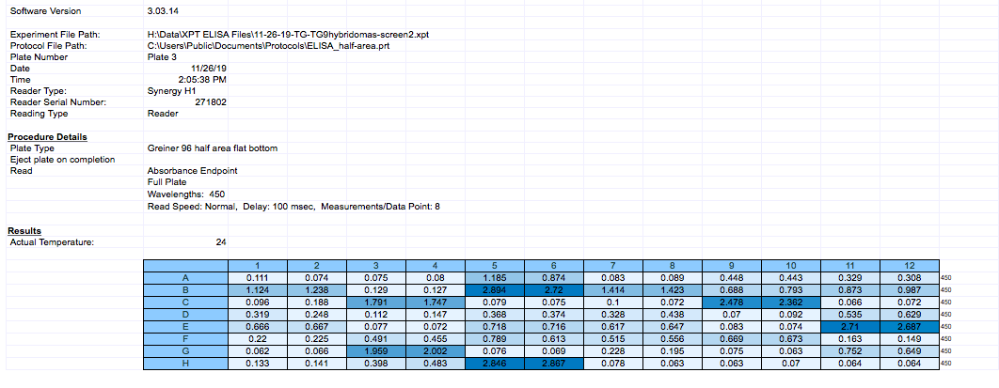

# Background Information

Hybridomas = immunized mouse B-cells fused with myeloma cell line for constant monoclonal antibody production

Project = Influenza hybridomas screened via ELISA against multiple viruses and viral proteins

ELISA outputs = 96-well excel tables

# Example Excel Sheet 

)

# Activate Packages
```{r message=FALSE, warning=FALSE}
library(knitr)
library(readr)
library(dplyr)
library(tidyverse)
library(ggplot2)
library(cowplot)
library(stringr)
library(rio)
library(readxl)
library(WriteXLS)
library(gridExtra)
```


# Import Excel Sheets and Rename

```{r message=FALSE, warning=FALSE}
allantoic <- read_excel('tg9-screen3-allantoicfl.xlsx', skip = 22)
cal09HA <- read_excel('tg9-screen3-calha.xlsx', skip = 22)
cal09NA <- read_excel('tg9-screen3-calna.xlsx', skip = 22)
cal09BV <- read_excel('tg9-screen3-calboil.xlsx', skip = 22)
cal09WV <- read_excel('tg9-screen3-wholecal.xlsx', skip = 22)
emptyplate <- read_excel('tg9-screen3-empty.xlsx', skip = 22)
mich15HA <- read_excel('tg9-screen3-michha.xlsx', skip = 22)

hy_list <- list(allantoic, cal09BV, cal09HA, cal09NA, cal09WV, emptyplate, mich15HA)
names(hy_list) = c("allantoic", "cal09HA", "cal09NA", "cal09BV", "cal09WV", "emptyplate", "mich15HA")
names(hy_list)
```

# Tidy/Munge Data + Use Function to Rename List Contents

```{r message=FALSE, warning=FALSE}
hy_list <- map(hy_list, gather, key = "position", value = "Value", 2:13)
hy_list <- map(hy_list, select, -2)
hy_list <- map(hy_list, unite, position, 1:2 , sep = "")
hy_list[['allantoic']]

for(n in c("allantoic", "cal09HA", "cal09NA", "cal09BV", "cal09WV", "emptyplate", "mich15HA")){
  names(hy_list[[n]]) <- str_replace(names(hy_list[[n]]), 'Value', n)}
hy_list[['allantoic']]
```

# Table1/2 = Use Reduce to Join All Files Together + Tidying 
```{r message=FALSE, warning=FALSE}
joined_hy_list <- reduce(hy_list, left_join, by = "position")
joined_hy_list

grouped_list <- gather(joined_hy_list, key = "antigen", value =  "Value", -1)
grouped_list
```

# Figure1/2 - Data Seperated by Antigen
```{r message=FALSE, warning=FALSE}
Allantoic_Fig <- ggplot(
  data = joined_hy_list, 
  mapping = aes(
    x = joined_hy_list$position,
    y = joined_hy_list$allantoic
  )
) +
  geom_point(
    mapping = aes(),
    size = 3,
    show.legend = F
  ) +
  theme(axis.text=element_text(size=3)) +
  labs(x = 'Position',
       y = 'OD450',
       title = 'Hybridoma ELISA Binding to Allantoic Fluid',
       subtitle = 'TG9 - Screen 3'
  )
Allantoic_Fig

WholeCal_Fig <- ggplot(
  data = joined_hy_list, 
  mapping = aes(
    x = joined_hy_list$position,
    y = joined_hy_list$cal09WV
  )
) +
  geom_point(
    mapping = aes(),
    size = 3,
    show.legend = F
  ) +
  theme(axis.text=element_text(size=3)) +
  labs(x = 'Position',
       y = 'OD450',
       title = 'Hybridoma ELISA Binding to Cal09 Whole Virus',
       subtitle = 'TG9 - Screen 3'
  )
WholeCal_Fig
```

# Figure 2 - Plot All Data on Single Figure
Difficult to see each point...

```{r message=FALSE, warning=FALSE}
Figure_1 <- ggplot(
  data = grouped_list,
  mapping = aes(
    x = grouped_list$antigen,
    y = grouped_list$Value
  )
) +
  geom_jitter(
    mapping = aes(color = grouped_list$position),
    size = 3,
    width = 0.2,
    show.legend = FALSE
  ) +
  labs(x = 'Antigen', 
       y = 'OD 450 Value',
       title = 'Hybridoma ELISA Binding to Antigen',
       subtitle = 'TG9 - Screen 3')
print(Figure_1)
```

# Attempt to Use facet_wrap to See All Wells at Once...
```{r message=FALSE, warning=FALSE}
Figure_1 <- ggplot(
  data = grouped_list,
  mapping = aes(
    x = grouped_list$antigen,
    y = grouped_list$Value
  )
) +
  geom_jitter(
    mapping = aes(color = grouped_list$position),
    size = 3,
    width = 0.2,
    show.legend = FALSE
  ) +
  facet_wrap(~grouped_list$position)
  labs(x = 'Antigen', 
       y = 'OD 450 Value',
       title = 'Hybridoma ELISA Binding to Antigen',
       subtitle = 'TG9 - Screen 3')
Figure_1
```


# Using group_by + summarize_at to Determine Mean by Antigen
```{r message=FALSE, warning=FALSE}
ctsvars <- grouped_list %>% select_if(is.numeric) %>% names()
average_by_antigen_table <- grouped_list %>% 
  group_by(antigen) %>% 
  summarise_at(vars(ctsvars), mean)

average_by_antigen_table
```

# Figure 3 - Average Binding Values by Antigen
```{r message=FALSE, warning=FALSE}
Figure_2 <- ggplot(
  data = average_by_antigen_table, 
  mapping = aes(
    x = average_by_antigen_table$antigen,
    y = average_by_antigen_table$Value
  )
) +
  geom_col(
    mapping = aes(),
    size = 3,
    show.legend = F
  ) +
  labs(x = 'Antigen',
       y = 'Average OD450 Value',
       title = 'Hybridoma ELISA Average Binding to Antigen',
       subtitle = 'TG9 - Screen 3'
  )
Figure_2
```


# Break Down Data into Smaller Subsets
```{r message=FALSE, warning=FALSE}
Group1 <- slice(joined_hy_list, 1:8)
Group2 <- slice(joined_hy_list, 9:16)
Group3 <- slice(joined_hy_list, 17:24)
Group4 <- slice(joined_hy_list, 25:32)
Group5 <- slice(joined_hy_list, 33:40)
Group6 <- slice(joined_hy_list, 41:48)
Group7 <- slice(joined_hy_list, 49:56)
Group8 <- slice(joined_hy_list, 57:64)
Group9 <- slice(joined_hy_list, 65:72)
Group10 <- slice(joined_hy_list, 73:80)
Group11 <- slice(joined_hy_list, 81:88)
Group12 <- slice(joined_hy_list, 89:96)

Group1 <- gather(Group1, key = "antigen", value = "Value", -1)
Group2 <- gather(Group2, key = "antigen", value = "Value", -1)
Group3 <- gather(Group3, key = "antigen", value = "Value", -1)
Group4 <- gather(Group4, key = "antigen", value = "Value", -1)
Group5 <- gather(Group5, key = "antigen", value = "Value", -1)
Group6 <- gather(Group6, key = "antigen", value = "Value", -1)
Group7 <- gather(Group7, key = "antigen", value = "Value", -1)
Group8 <- gather(Group8, key = "antigen", value = "Value", -1)
Group9 <- gather(Group9, key = "antigen", value = "Value", -1)
Group10 <- gather(Group10, key = "antigen", value = "Value", -1)
Group11 <- gather(Group11, key = "antigen", value = "Value", -1)
Group12 <- gather(Group12, key = "antigen", value = "Value", -1)
```

# Figure 4/5 - Smaller Subsets of the Data to See Trends by Well Number
```{r message=FALSE, warning=FALSE}
Group1_Fig <- ggplot(
  data = Group1,
  mapping = aes(
    x = Group1$antigen,
    y = Group1$Value
  )
) +
  geom_jitter(
    mapping = aes(color = Group1$position),
    size = 3,
    width = 0.1,
    show.legend = TRUE
  ) +
  labs(x = 'Antigen', 
       y = 'OD 450 Value',
       title = 'Hybridoma ELISA Binding to Antigen - A1-H1',
       subtitle = 'TG9 - Screen 3') +
  theme(legend.title=element_blank())

Group1_Fig

Group2_Fig <- ggplot(
  data = Group2,
  mapping = aes(
    x = Group2$antigen,
    y = Group2$Value
  )
) +
  geom_jitter(
    mapping = aes(color = Group2$position),
    size = 3,
    width = 0.1,
    show.legend = TRUE
  ) +
  labs(x = 'Antigen', 
       y = 'OD 450 Value',
       title = 'Hybridoma ELISA Binding to Antigen - A2-H2',
       subtitle = 'TG9 - Screen 3') +
  theme(legend.title=element_blank())

Group2_Fig

Group12_Fig <- ggplot(
  data = Group12,
  mapping = aes(
    x = Group12$antigen,
    y = Group12$Value
  )
) +
  geom_jitter(
    mapping = aes(color = Group12$position),
    size = 3,
    width = 0.1,
    show.legend = TRUE
  ) +
  labs(x = 'Antigen', 
       y = 'OD 450 Value',
       title = 'Hybridoma ELISA Binding to Antigen - A12-H12',
       subtitle = 'TG9 - Screen 3') +
  theme(legend.title=element_blank())

Group12_Fig
```

# Conclusions

Successful: was able to quickly join + visualize data to look for important points

Future goals: continue to work on making functions to require less modification for future screen inputs, interactive figures/shiny?

