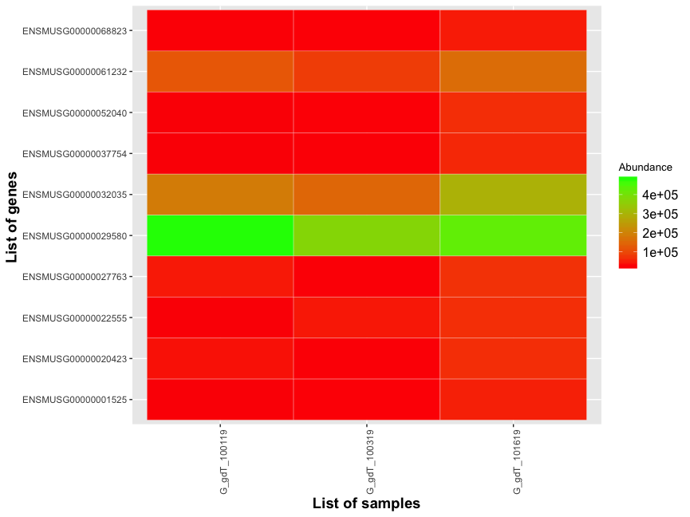
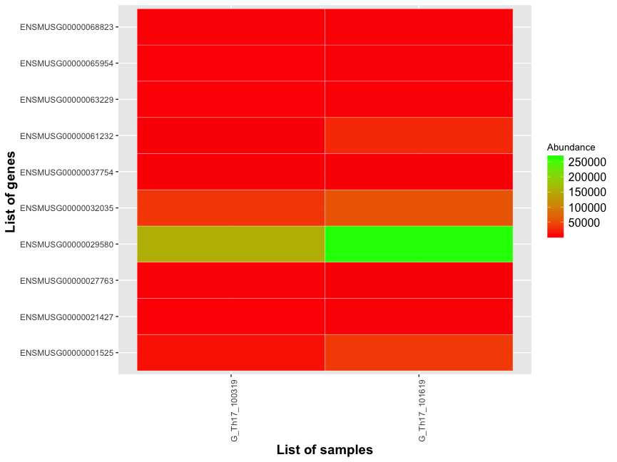
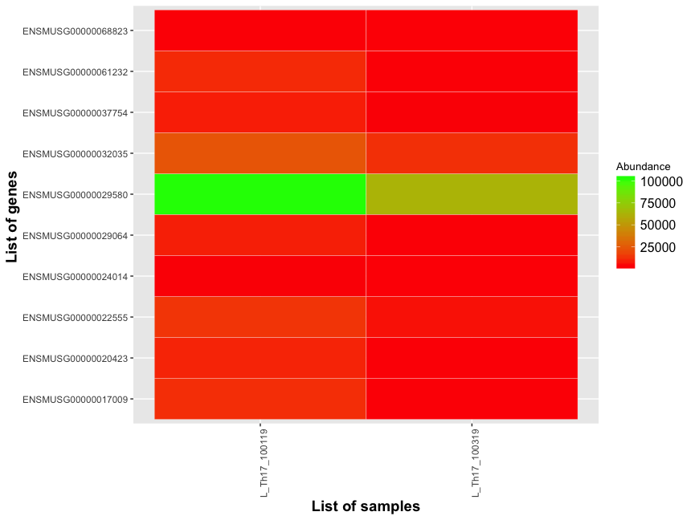
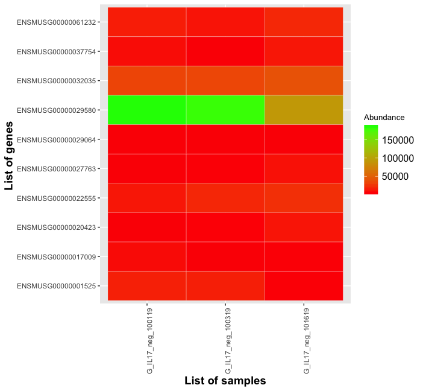
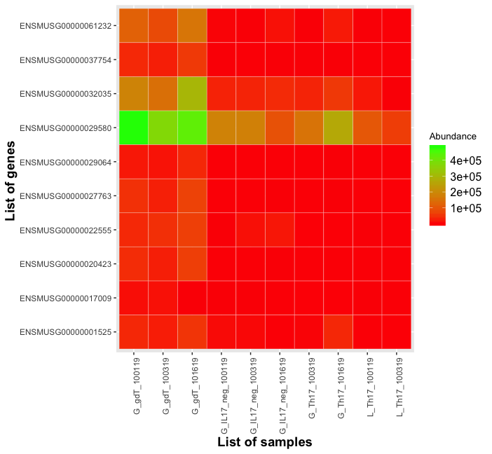

```{r setup, include=FALSE}
library(flexdashboard)
```

Column {data-width=650}
-----------------------------------------------------------------------

### gdT



### Gingiva Th17



### Lymph nodes Th17



### Other T cells



### All T cells



