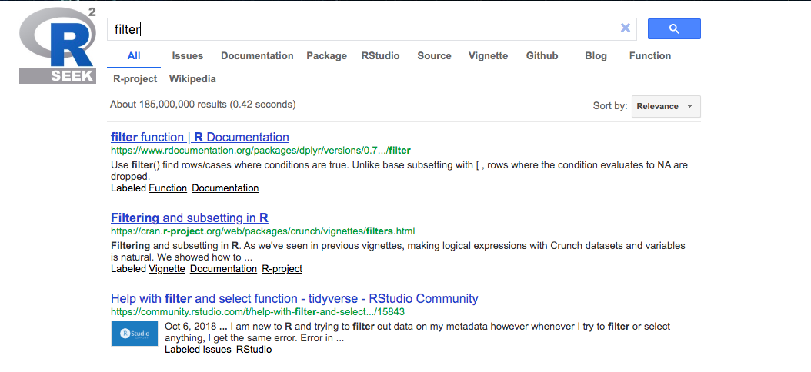
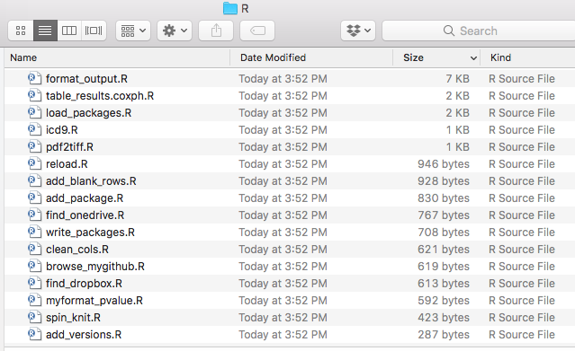
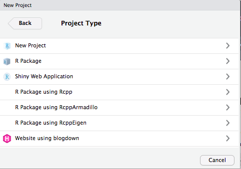
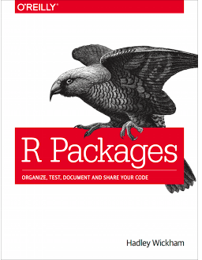

```{r setup, include=FALSE}
knitr::opts_chunk$set(echo = TRUE, comment = '#> ')
```

layout: true

<div class="my-header">
<span>BIOF339</span></div>

---
class: middle,center

# Search strategies 

---

## Google/Bing/DuckDuckGo

+ A problem we have here is that "R" is just a letter of the alphabet, so we get too many results
+ The same term (say, `filter` or `print`) is used in various contexts and in various computer languages

---

## Google/Bing/DuckDuckGo


+ **Strategy 1:** Use "CRAN" instead of "R" to mean R. If there is a package that meets your needs, this will pick it up
+ **Strategy 2:** You can use "-" to qualify what you don't want to search for. So you could do "signal R -python" to look for sites which are not talking about Python
+ **Strategy 3:** Restrict yourself to [StackOverflow](https://stackoverflow.com) or [Cross-Validated](https://stats.stackexchange.com/), which are dedicated to computer issues
    - On StackOverflow and CrossValidated, R issues have the tag "r"
    - Have thick skin, since things can get heated sometimes if you are thought to have asked a "stupid" question

---

## rseek.org, a better choice



---

## Twitter

The R community is organized on Twitter with the hashtag ["#rstats"](https://twitter.com/search?q=%23rstats&src=typed_query)

- This is a very active community
- Welcoming, diverse, patient, quick, fun
- Lots of top developers contribute daily (Wickham, Averick, lots of RStudio folk, package developers)
- Can virtually follow all the major and minor R conferences, since someone is certainly live-tweeting. Just need to find the hashtag or conference Twitter handle
- Almost never bashed for asking a "stupid" question

---

[](https://www.r-bloggers.com/)

Israel-based blog aggregator dedicated to R.

- Find blogs on almost any R topic under the sun (since 2005)
- Announcements of new packages
- Hundreds of contributing blogs
- Some curated tutorials

---

## Other websites of interest

- [Awesome-R](https://awesome-r.com/): A curated list of R packages and tools
- [Flowing Data](https://flowingdata.com/): One of the top visualization blogs out there, based in R, by Nathan Yau


---
class: middle, center

# Stealing code

---

## GitHub `r fontawesome::fa("github")`

GitHub is a website where developers come to play. It hosts *repositories* of code where people can submit issues, contribute code and co-develop software products. 

Most R developers put their developing code on GitHub. There are over 108,000 repositories on GitHub using R. 

To see what's there, [click here](https://github.com/search?l=R&q=R&type=Repositories)

Developers to follow:

- [RStudio](https://github.com/rstudio)
- [ROpenSci](https://github.com/ropensci)
- [tidyverse](https://github.com/tidyverse/)


---
class: center, middle

# Changing some default behaviors

---

## .Rprofile

You can create a `.Rprofile` file either in each project or globally (place the file in your HOME folder)

Every time R starts, it will look at this file and load things if you so specify

Some examples you could put in there to be available every time

```{r 13-Misc-1, eval=F}
## ht == headtail
ht = function(d, n=6) rbind(head(d, n), tail(d, n))

local({
  r = getOption("repos")             
  r["CRAN"] = "https://cran.rstudio.com/"
  options(repos = r)
})
```

> Don't put anything in there that might make your R non-portable, for example `options(stringsAsFactors=F)`.

See this [chapter](https://csgillespie.github.io/efficientR/3-3-r-startup.html#r-startup) of "Efficient R Programming" by Gillespie and Lovelace. 


---

## Changing default operations for a R class

R uses what is called the *S3* system for object oriented programming. It is a simplistic system where you create a default function and then specify functions for different classes. For example:

```{r 13-Misc-2, eval=F}
format_output <- function(x,...){
  # Make a S3 class
  UseMethod('format_output',x)
}

format_output.lm <- function(x, refs=NULL, labs=NULL, pretty=T){
  tmp <- summary(x)$coef
  if(is.null(refs)){
    term <- attr(x$terms, 'term.labels')
  } else {
    term <- names(refs)
  }
  out <- data.frame(tmp[,c(1,2,4)])
  names(out) <- c('LOR','SE','pvalue')
  
  ## Truncated for space, see https://github.com/webbedfeet/abhiR.git
```

So class-specific functions just need the name of the class after the dot.

---

## Changing default operations for a R class

Sometimes, there already is a default that you want to change. Then you don't need to create the generic first since it already exists

```{r 13-Misc-3}
print.lm <- function(x){
  suppressPackageStartupMessages(require(tidyverse))
  require(broom)
  out <- tidy(x) %>% 
    select(term, estimate, p.value)
  print(out)
}
```

So now:

```{r 13-Misc-4, message=F, warning=F}
m <- lm(mpg ~ wt, data = mtcars)
print(m)
```

---

## Creating your own function repository

You should create functions that you use all the time and make your own repository

Create each function in a separate file, and then load them using the `source` function.



---

## Creating packages

Creating packages sounds intimidating, but really isn't

The `devtools` package makes it very easy. So does RStudio.



---

## R packages

[](http://r-pkgs.had.co.nz/)
