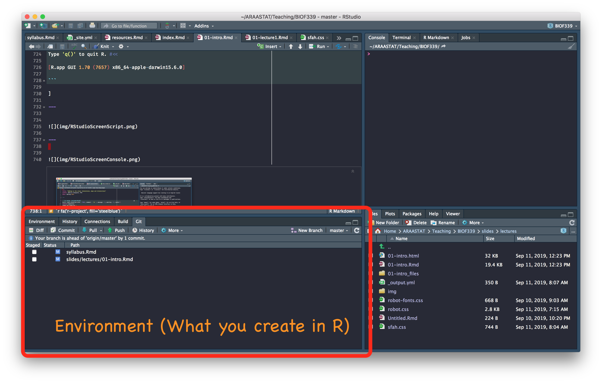
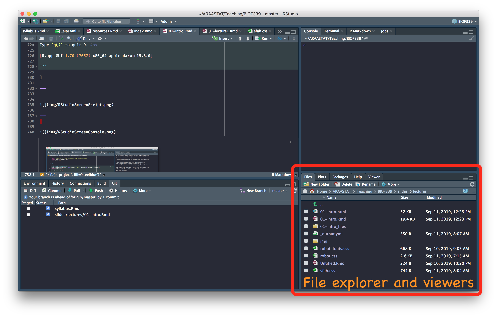
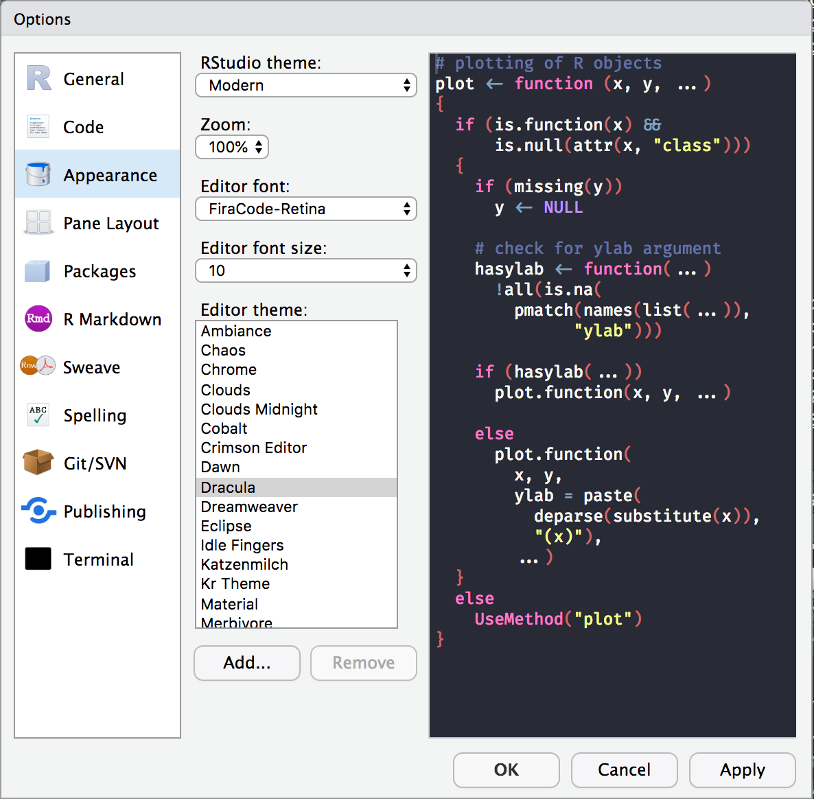
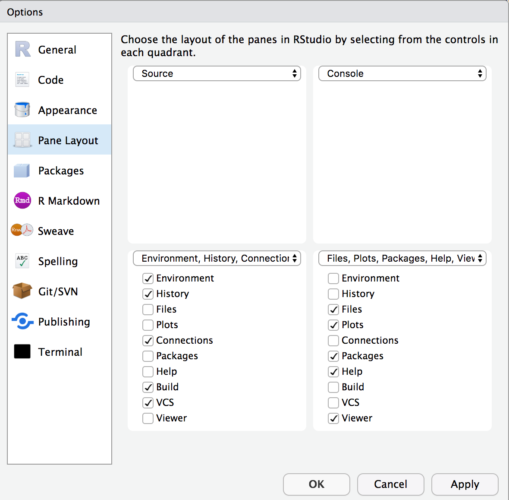
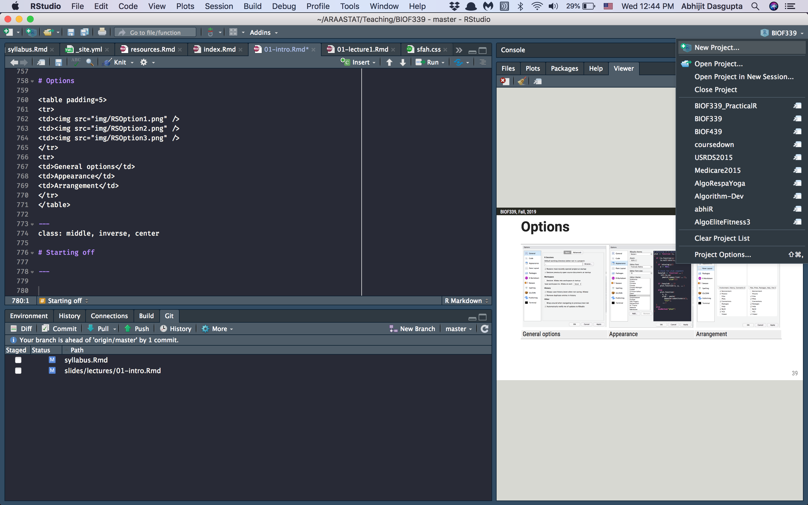
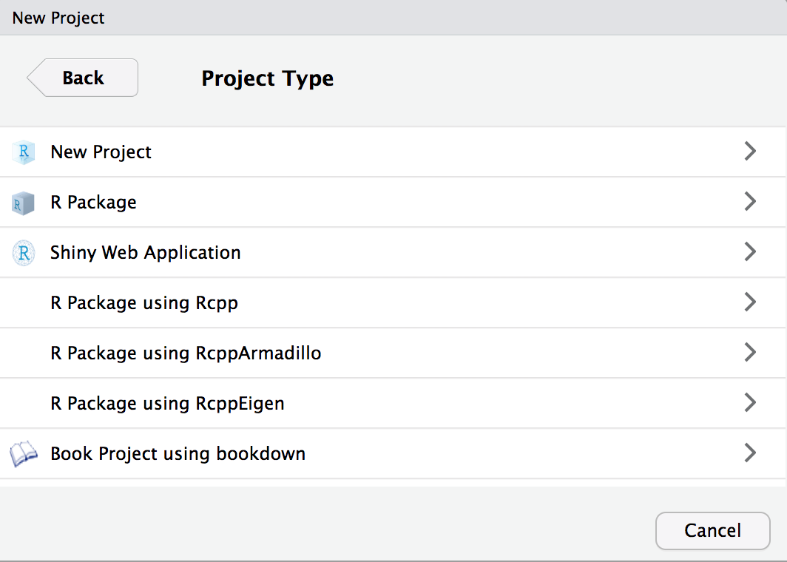
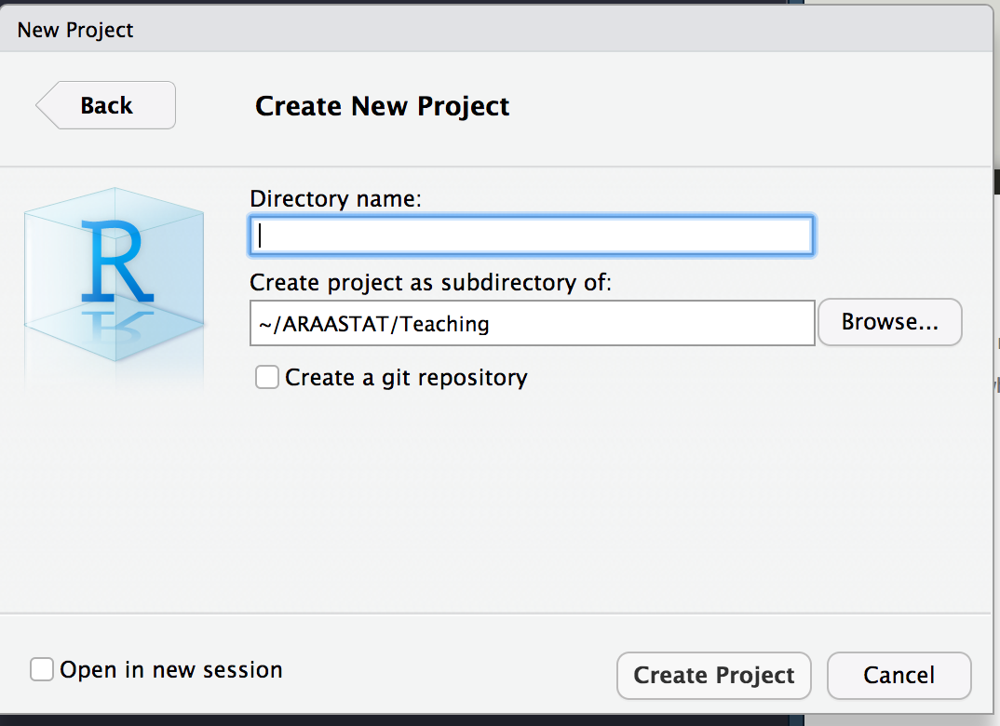
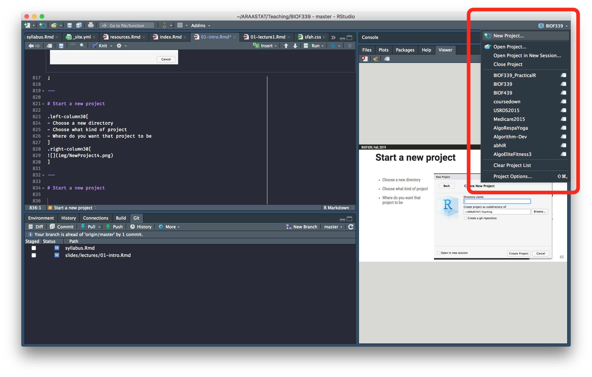

```{r setup, include=FALSE}
knitr::opts_chunk$set(echo = TRUE, comment = '#> ')
knitr::opts_chunk$set( warning=F, message = F, fig.retina=3)
library(tidyverse)
library(lubridate)
library(knitr)
library(pander)
library(fontawesome)
library(emo)
library(countdown)
```

layout: true

<div class="my-header">
<span>BIOF339</span></div>
</div>


---
class: middle, center


---
```{r, child='../../Personal/slideFormat.Rmd'}

```


# What does R look like?
.right-column30[

```{r ex, echo=T, eval=F}
# Determining frequencies of breast cancer subtypes

type_frequencies <- 
  breast_cancer %>% 
    mutate(luminalA = ifelse(ER == '+' & PR == '+' & HER2 == '-', 1, 0),
         luminalB = ifelse(ER == '+' & PR == '-' & HER2 == '+', 1, 0),
         her2 = ifelse(ER == '-' & PR == '-' & HER2 == '+', 1, 0),
         basal = ifelse(ER == '-' & PR == '-' & HER2 == '-', 1, 0)) %>% 
    mutate(type = case_when(
      luminalA == 1 ~ "Luminal A",
      luminalB == 1 ~ "Luminal B",
      her2 == 1 ~ "HER2",
      basal == 1 ~ "Basal",
      TRUE ~ NA)) %>%
    count(type)
```
]

--

.left-column30[
+ A .heatinline[scripting] language
  - Provide instructions to the computer
  - in a .saltinline[structured] manner
  - to do statistical analysis
]
---

# What does R look like?

.left-column30[
+ Start with a data set
]
.right-column30[

```{r ex1, eval=F}
# Determining frequencies of breast cancer subtypes

type_frequencies <- 
  breast_cancer %>% #<<
    mutate(luminalA = ifelse(ER == '+' & PR == '+' & HER2 == '-', 1, 0),
         luminalB = ifelse(ER == '+' & PR == '-' & HER2 == '+', 1, 0),
         her2 = ifelse(ER == '-' & PR == '-' & HER2 == '+', 1, 0),
         basal = ifelse(ER == '-' & PR == '-' & HER2 == '-', 1, 0)) %>% 
    mutate(type = case_when(
      luminalA == 1 ~ "Luminal A",
      luminalB == 1 ~ "Luminal B",
      her2 == 1 ~ "HER2",
      basal == 1 ~ "Basal",
      TRUE ~ NA)) %>%
    count(type)
```
]

---

# What does R look like?

.left-column30[
+ Start with a data set
+ Create new variables from old variables
]
.right-column30[

```{r ex2, eval=F}
# Determining frequencies of breast cancer subtypes

type_frequencies <- 
  breast_cancer %>% 
    mutate(luminalA = ifelse(ER == '+' & PR == '+' & HER2 == '-', 1, 0), #<<
         luminalB = ifelse(ER == '+' & PR == '-' & HER2 == '+', 1, 0), #<<
         her2 = ifelse(ER == '-' & PR == '-' & HER2 == '+', 1, 0), #<<
         basal = ifelse(ER == '-' & PR == '-' & HER2 == '-', 1, 0)) %>% #<<
    mutate(type = case_when(
      luminalA == 1 ~ "Luminal A",
      luminalB == 1 ~ "Luminal B",
      her2 == 1 ~ "HER2",
      basal == 1 ~ "Basal",
      TRUE ~ NA)) %>%
    count(type)
```
]

---

# What does R look like?

.left-column30[
+ Start with a data set
+ Create new variables from old variables
+ Deal with missing values
]
.right-column30[

```{r ex3, eval=F}
# Determining frequencies of breast cancer subtypes

type_frequencies <- 
  breast_cancer %>% 
    mutate(luminalA = ifelse(ER == '+' & PR == '+' & HER2 == '-', 1, 0), 
         luminalB = ifelse(ER == '+' & PR == '-' & HER2 == '+', 1, 0), 
         her2 = ifelse(ER == '-' & PR == '-' & HER2 == '+', 1, 0), 
         basal = ifelse(ER == '-' & PR == '-' & HER2 == '-', 1, 0)) %>% 
    mutate(type = case_when(
      luminalA == 1 ~ "Luminal A",
      luminalB == 1 ~ "Luminal B",
      her2 == 1 ~ "HER2",
      basal == 1 ~ "Basal",
      TRUE ~ NA)) %>% #<<
    count(type)
```
]

---

# What does R look like?

.left-column30[
+ Start with a data set
+ Create new variables from old variables
+ Deal with missing values
+ Find the frequencies
]
.right-column30[

```{r ex4, eval=F}
# Determining frequencies of breast cancer subtypes

type_frequencies <- 
  breast_cancer %>% 
    mutate(luminalA = ifelse(ER == '+' & PR == '+' & HER2 == '-', 1, 0), 
         luminalB = ifelse(ER == '+' & PR == '-' & HER2 == '+', 1, 0), 
         her2 = ifelse(ER == '-' & PR == '-' & HER2 == '+', 1, 0), 
         basal = ifelse(ER == '-' & PR == '-' & HER2 == '-', 1, 0)) %>% 
    mutate(type = case_when(
      luminalA == 1 ~ "Luminal A",
      luminalB == 1 ~ "Luminal B",
      her2 == 1 ~ "HER2",
      basal == 1 ~ "Basal",
      TRUE ~ NA)) %>%
    count(type) #<<
```
]


---

# What does R look like?

.left-column30[
+ Start with a data set
+ Create new variables from old variables
+ Deal with missing values
+ Find the frequencies
+ .heatinline[Comment on what you're doing]
]
.right-column30[

```{r ex5, eval=F}
# Determining frequencies of breast cancer subtypes #<<

type_frequencies <- 
  breast_cancer %>% 
    mutate(luminalA = ifelse(ER == '+' & PR == '+' & HER2 == '-', 1, 0), 
         luminalB = ifelse(ER == '+' & PR == '-' & HER2 == '+', 1, 0), 
         her2 = ifelse(ER == '-' & PR == '-' & HER2 == '+', 1, 0), 
         basal = ifelse(ER == '-' & PR == '-' & HER2 == '-', 1, 0)) %>% 
    mutate(type = case_when(
      luminalA == 1 ~ "Luminal A",
      luminalB == 1 ~ "Luminal B",
      her2 == 1 ~ "HER2",
      basal == 1 ~ "Basal",
      TRUE ~ NA)) %>%
    count(type) 
```
]

--

.center[This is an example of a .heatinline[pipeline] in R. We'll develop different aspects of this
progressively throughout the semester]

---

# Why use a scripting language for analysis?

.pull-left[
.large[Pros:]

1. .heatinline[Have to think]
1. Reproducible (custom) workflows
1. Much less error-prone
1. Much lower costs to repeat analyses, or as you learn more
1. Easily leverage work of smarter developers
1. Easier to work with larger datasets (more than size of screen)
]
.pull-right[
.large[Cons:]

1. Have to type
1. Have to know the language
1. Higher initial startup cost
1. .heatinline[Have to think]
]

---

# Why use a scripting language for analysis?

.pull-left[
.large[Pros:]

1. .fatinline[Have to think]
1. Reproducible (custom) workflows
1. Much less error-prone
1. Much lower costs to repeat analyses, or as you learn more
1. Easily leverage work of smarter developers
1. Easier to work with larger datasets (more than size of screen)
]
.pull-right[
+ You're giving instructions to a fast but stupid machine
+ This machine will do .heatinline[**exactly**] what you tell it
+ The machine is capable of amazing things
+ Can't just _menu-mine_ and try things that __seem__ to be what you want

#### With great power comes great responsibility

#### But also great benefits

]

---

# Why use a scripting language for analysis?

.pull-left[
.large[Pros:]

1. Have to think
1. Reproducible (custom) workflows
1. .fatinline[Much less error-prone]
1. Much lower costs to repeat analyses, or as you learn more
1. Easily leverage work of smarter developers
1. Easier to work with larger datasets (more than size of screen)
]
.pull-right[
+ If your code is not right, it won't run
  - Can be frustrating
  - But if it runs you're much more confident
+ If you screw up in Excel
  - almost impossible to recover
+ You have much more control over what you're doing
]

---

# Why use a scripting language for analysis?

.pull-left[
.large[Pros:]

1. Have to think
1. Reproducible (custom) workflows
1. Much less error-prone
1. Much lower costs to repeat analyses, or as you learn more
1. .fatinline[Easily leverage work of smarter developers]
1. Easier to work with larger datasets (more than size of screen)
]
.pull-right[
+ Can use _modules_ or _packages_ developed by others
  - `tidyverse`, `Seurat`, `ggplot2`
+ Can "steal" code from others (provided license allows)
]

---

# Why use a scripting language for analysis?

.pull-left[
.large[Pros:]

1. Have to think
1. Reproducible (custom) workflows
1. Much less error-prone
1. Much lower costs to repeat analyses, or as you learn more
1. Easily leverage work of smarter developers
1. .fatinline[Easier to work with larger datasets (more than size of screen)]
]
.pull-right[
Good luck working with

+ GWAS data
+ fMRI data
+ Stocks and bonds data
+ Sports data
+ Many more ...

in a unified environment  

Learn once, use everywhere
]

---

# Why use `r fa('r-project', fill='steelblue')`?

+ Specializes in statistics and data visualization
+ Flexible
  - ~~_If you can do it_~~ __How you can do it__
+ Large ecosystem
  - Over 16,000 packages, 1500+ dedicated to bioinformatics
  - Can read from most sources of data
  - Generic and specialized analyses
+ Fantastic community
  - Twitter, StackOverflow, blogosphere, conferences, online books

---

# Why use `r fa('r-project', fill='steelblue')`?

R is a very high-quality product that is accepted and used widely in 
government agencies, corporations and universities worldwide

- Standard data analytic software in bioinformatics, behavioral health and many aspects of quantitative finance
- Increasingly used in pharma, economics, political science and engineering

--

R is open-source, in that anyone can see the actual code and validate the 
computations directly

---

# Why use `r fa('r-project', fill='steelblue')`?

- R has a well-deserved reputation for being a great data visualization 
tool, with users being able to create complex, customizable graphs with relative 
ease
- As a scripting language, it allows the same workflows to be coded and re-used.
- You can set up workflows to validate data, in terms of data quality and missingness, 
which avoids visual inspection which can be time-consuming and mistake-prone. 
- R can handle large datasets, and can work with multiple datasets at the same time

---

# Why use `r fa('r-project', fill='steelblue')`?

Specialized packages available for many domains

- Bioinformatics
- Econometrics
- Maps and spatial analytics 
- Text mining and Natural Language Processing

The [CRAN Task Views](https://cran.r-project.org/web/views/) 
provide curated lists of packages based on different domains

The [Bioconductor Project](https://www.bioconductor.org) is THE source for bioinformatics packages in R. It is the gold standard for many bioinformatic workflows


---

# Things `r fa('r-project', fill='steelblue')` is not (in this class)

--

- The 18th letter of the English alphabet

--

- A magic incantation that will produce an analysis

--

- Just something the cool kids are doing

--

- Point-and-click, automatic, WYSIWYG (What you see is what you get)
    - So it's not Excel, SPSS, Prism, GraphPad
    - It's much more!!!

---

# A note on Excel `r fa('file-excel', fill='steelblue')`

.pull-left[
   

Excel is omnipresent, so it becomes the default data medium

It is great for many things, including _quick-and-dirty_ analyses

.heatinline[It can be error-prone]

It needs to be backed up

It has size limitations

Takes a lot of effort to do complex analyses
]

--

.pull-right[
+ No way to reproduce analyses without macros
+ No way to document what you are doing
+ Excel has some nasty default behavior
  - Guess what the `MAR1` gene gets recorded as?
+ Very hard to recover from errors
  - Shift of one error (off by one row or column)
  - Google _Duke Potti_ or _Reinhart Rogoff Herndon_
]

---
class: middle, center, inverse
name: about
# About this class

---

## Learning Objectives

- Run R and RStudio, making use of inherent R features
- Find and make use of the extensive packages (R add-ons) available for analyzing biological and other forms of data
- Load, manipulate, and combine data to make it amenable to further analyses
- Visualize data with extensive graphics capabilities of R (including ggplot)
- Use R to run statistical models and hypothesis tests and report results conforming to standards expected in scientific journals
- Write reports using the powerful `rmarkdown` package and its derivatives

---

# Plan

```{r outline, echo = FALSE, warning=F, message=F}

dts <- paste('Week', 1:7)
topics <- c(
  'Introduction to R: Working environmnent and data structures',
  'Using packages to enhance data ingestion, munging, and reporting',
  'Data visualization for exploration and reporting',
  'Statistical analyses using R',
  'Statistical learning using R',
  'Designing and analyzing experiments, with a sprinkling of bioinformatics',
  'Reproducible documents for analytic reporting'
)

D <- tibble( Week = dts, Topic=topics)
knitr::kable(D)

```

---

## Teaching materials

1. The main ideas for the week will be developed through videos, screencasts and slides
1. I will assign tutorials where you can interactively work with R to improve your understanding
    + [RStudio Primers](https://rstudio.cloud/learn/primers)
    + I will create and periodically update a R package of R tutorials, that will be called `BIOF339Tutorials`. Instructions are forthcoming


---

# Grading rubric

1. Homeworks for each week are due Sunday at 11:59pm (50%)
    - No late homeworks
    - We'll have 6 homeworks, I'll score the top 4 for grade
1. Final project: A RMarkdown report/presentation demonstrating an end-to-end data analysis in R using your own data, from data ingestion to munging to analyses and graphics, with a brief introduction and conclusion (30%)
1. Class participation (20%): Discussion topics each week

---

# Submitting assignments

## Homework

+ All homework will be submitted via Canvas
+ You must submit your homework using R Markdown
    - The submission will consist of 2 files: A Rmd file and the corresponding HTML file. Both are required for full credit. 
+ I will initially provide templates for the homework, but you will be expected to create your own R Markdown documents by week 4. 

---

# Communication

- Primarily via `r fa('slack')` [Slack](http://www.slack.com). 
  - Please join the BIOF339 Slack channel using [this link](https://join.slack.com/t/biof339/shared_invite/zt-hczp2mg1-Yh0yqms52wAA8H445jkBUg).
  - You will see a channel `#fall2020-a`. Please join this channel
- Slack for broadcasting messages, answering questions and the like. 
  - If you have a question, you can directly message me on Slack. Expect an answer within 24 hours.
- Office hours by appointment

---

# Class project

- Create a R Markdown document or presentation
- Use your own data, or data available on the web (legally)
- Show me that you can 
  - import data into R
  - manipulate (munge) the data
  - perform some analysis on the data
  - create a visualization
  - create a report in R Markdown
- 5 minute _lightning talks_ that can be recorded using Quicktime or [Screencastify](https://www.screencastify.com/)

---
class: inverse, middle, center

`r fa('r-project', fill='steelblue', height=200)`   &nbsp;&nbsp;&nbsp;&nbsp;&nbsp;&nbsp;&nbsp;     

---


# `r fa('r-project', fill='steelblue')`

R is the scripting language we will use for statistical analysis

It comes with a very basic GUI and is not very user-friendly as is

.center[
```{r 01-intro-1, echo = F, out.height='350px', out.width='350px'}
knitr::include_graphics('img/R1.png')
```
]


---


RStudio is a much nicer Integrated Development Environment (IDE) that runs R

.left-column30[
- You can customize the look and feel of RStudio
- We'll go through the features of RStudio in a minute
]
.right-column30[
```{r 01-intro-2, echo = F, out.width = "600px", out.height="400px"}
knitr::include_graphics('img/RStudioScreen.png')
```
]
---

# `r fa('r-project', fill='steelblue')`

.left-column30[
- The version of R you're running
]
.right-column30[

When you start R, this is what shows up
```{r 01-intro-3, eval=F, echo = T}
R version 3.6.0 (2019-04-26) -- "Planting of a Tree" #<<
Copyright (C) 2019 The R Foundation for Statistical Computing
Platform: x86_64-apple-darwin15.6.0 (64-bit)

R is free software and comes with ABSOLUTELY NO WARRANTY.
You are welcome to redistribute it under certain conditions.
Type 'license()' or 'licence()' for distribution details.

  Natural language support but running in an English locale

R is a collaborative project with many contributors.
Type 'contributors()' for more information and
'citation()' on how to cite R or R packages in publications.

Type 'demo()' for some demos, 'help()' for on-line help, or
'help.start()' for an HTML browser interface to help.
Type 'q()' to quit R.

[R.app GUI 1.70 (7657) x86_64-apple-darwin15.6.0]

```

]

---

# `r fa('r-project', fill='steelblue')`

.left-column30[
- The version of R you're running
- The operating system you're running
]
.right-column30[

When you start R, this is what shows up
```{r 01-intro-4, eval=F, echo = T}
R version 3.6.0 (2019-04-26) -- "Planting of a Tree" 
Copyright (C) 2019 The R Foundation for Statistical Computing
Platform: x86_64-apple-darwin15.6.0 (64-bit) #<<

R is free software and comes with ABSOLUTELY NO WARRANTY.
You are welcome to redistribute it under certain conditions.
Type 'license()' or 'licence()' for distribution details.

  Natural language support but running in an English locale

R is a collaborative project with many contributors.
Type 'contributors()' for more information and
'citation()' on how to cite R or R packages in publications.

Type 'demo()' for some demos, 'help()' for on-line help, or
'help.start()' for an HTML browser interface to help.
Type 'q()' to quit R.

[R.app GUI 1.70 (7657) x86_64-apple-darwin15.6.0]

```

]

---

# `r fa('r-project', fill='steelblue')`

.left-column30[
- The version of R you're running
- The operating system you're running
- It's free, with no guarantees, but is known to be solid and well-maintained
]
.right-column30[

When you start R, this is what shows up
```{r 01-intro-5, eval=F, echo = T}
R version 3.6.0 (2019-04-26) -- "Planting of a Tree" 
Copyright (C) 2019 The R Foundation for Statistical Computing
Platform: x86_64-apple-darwin15.6.0 (64-bit) 

R is free software and comes with ABSOLUTELY NO WARRANTY. #<<
You are welcome to redistribute it under certain conditions.
Type 'license()' or 'licence()' for distribution details.

  Natural language support but running in an English locale

R is a collaborative project with many contributors.
Type 'contributors()' for more information and
'citation()' on how to cite R or R packages in publications.

Type 'demo()' for some demos, 'help()' for on-line help, or
'help.start()' for an HTML browser interface to help.
Type 'q()' to quit R.

[R.app GUI 1.70 (7657) x86_64-apple-darwin15.6.0]

```

]

---


# `r fa('r-project', fill='steelblue')`

.left-column30[
- The version of R you're running
- The operating system you're running
- It's free, with no guarantees, but is known to be solid and well-maintained
- You can find help online
]
.right-column30[

When you start R, this is what shows up
```{r 01-intro-6, eval=F, echo = T}
R version 3.6.0 (2019-04-26) -- "Planting of a Tree" 
Copyright (C) 2019 The R Foundation for Statistical Computing
Platform: x86_64-apple-darwin15.6.0 (64-bit) 

R is free software and comes with ABSOLUTELY NO WARRANTY. 
You are welcome to redistribute it under certain conditions.
Type 'license()' or 'licence()' for distribution details.

  Natural language support but running in an English locale

R is a collaborative project with many contributors.
Type 'contributors()' for more information and
'citation()' on how to cite R or R packages in publications.

Type 'demo()' for some demos, 'help()' for on-line help, or #<<
'help.start()' for an HTML browser interface to help. #<<
Type 'q()' to quit R. #<<

[R.app GUI 1.70 (7657) x86_64-apple-darwin15.6.0]

```

]

---
class: middle, center


### The exact look won't match yours. See demo

---


---


---



---



---

# Options

<table padding=5>
<tr>
<td>
<td>
<td>
</tr>
<tr>
<td>General options</td>
<td>Appearance</td>
<td>Arrangement</td>
</tr>
</table>

---
class: middle, inverse, center

# Starting off

---



---

# Start a new project

.left-column30[
A __RStudio project__ allows you to encapsulate each analysis project

- Keeps files, data, and R separate between projects
- Allows you to work on different projects concurrently
]
.right-column30[

]

---

# Starting a new project

.left-column30[
+ Choose a new directory
]
.right-column30[

]

---

# Start a new project

.left-column30[
- Choose a new directory
- Choose what kind of project
]
.right-column30[

]

---

# Start a new project

.left-column30[
- Choose a new directory
- Choose what kind of project
- Where do you want that project to be
]
.right-column30[

]

---

# Start a new project

.left-column30[
- Choose a new directory
- Choose what kind of project
- Where do you want that project to be
- Switch betwen projects easily
]
.right-column30[

]

---
class: middle, center

# Working in a project

---

# Open a new script 

.left-column30[
You will start by opening a new script

- This is a blank canvas
- You will write R code (instructions) in this script
- This is just a text editor, so you can copy, paste, edit just as in Notepad
- Good practice is to write code in the script window, then **send** the code to R
]
.right-column30[

]

---

# Run some code

.pull-left[

Write some code, then send it to the console, where R is running

- You can use the button, but
- I prefer you learn the keyboard shortcut
- Ctrl/Cmd + Enter sends either
  - current line under cursor
  - highlighted code
]
.pull-right[

]

---
class: middle, center, inverse

# Let's play for a while

---

### A calculator

```{r 01-intro-7, echo = T}
2 + (3 * 5) / 1.75
```

### A random number generator

```{r 01-intro-8, echo=T}
set.seed(2085)
runif(10, 0, 10)
```

---

# Exploring a data set

The `airquality` dataset, built in to R, provides daily air quality measurements in New York, May to September 1973.


```{r 01-intro-9, echo = T, eval=F}
airquality
```

This automatically prints out the full data set, but that's not really useful

.pull-left[
```{r 01-intro-10, echo = T}
str(airquality)
```
Note the missing values, denoted `NA`
]

--

.pull-right[
```{r 01-intro-11, echo = T}
head(airquality)
```
]

---

# Exploring a data set

.pull-left[
```{r 01-intro-12, echo = T}
summary(airquality)
```
]
.pull-right[
```{r 01-intro-13, echo=T }
library(tableone) # Use a package
kableone(CreateTableOne(data=airquality), 
         format='html')
```

We'll talk more about this in coming weeks.
]

--

> Sorry!!! You probably don't have the `tableone` package `r emo::ji('sad')`

---

# Sidebar: Installing packages

```{r 01-intro-14, echo=T, eval = F}
install.packages('tableone')
```

You should do this directly in the console rather than in the script. Why? Because
you only have to do this once (per computer). You don't need to re-install packages
every time. 

>Some packages I might use might not install this way, since they are 
developmental and not released. We'll talk about how to install those later. For you 
Windows folk, it will take a little bit of work
---

# Exploring one variable

.pull-left[
```{r 01-intro-15, echo = T}
mean(airquality$Temp)
```

```{r 01-intro-16, echo = T}
median(airquality$Temp)
```
]
.pull-right[
```{r 01-intro-17, echo=T}
hist(airquality$Temp)
```
]

---

# Exploring two variables

.pull-left[
```{r 01-intro-18, echo = T, out.height=400}
plot(Ozone ~ Month, data = airquality)
```
]
.pull-right[
```{r 01-intro-19, echo = T, out.height=400}
library(ggplot2)
ggplot(airquality) + 
  geom_point(aes(x = Month, y = Ozone)) + 
  geom_smooth(aes(x = Month, y = Ozone), color = 'green') +
  theme_bw()
```

]

---

# Is there a difference in ozone between months

.pull-left[
```{r 01-intro-20, echo=T}
summary(aov(Ozone ~ Month, data=airquality))
```

Whoops!! Only 1 df but 5 months!! 

This is doing ANCOVA/Regression
]

--

.pull-right[
```{r 01-intro-21, echo=T}
summary(aov(Ozone~factor(Month), data=airquality))
```

`factor` can convert a numerical or character variable into a categorical variable
]

--

> I'm doing a lot of things on the fly here. We'll work through these at a saner pace in the coming weeks. Don't panic!! Breathe!!!

---
class: middle, center, inverse

# RMarkdown

---


---

.left-column30[
+ There are some choices you might need to make
  + Document is like a paper
  + Presentation is like PowerPoint
  + Shiny is an interactive web app developed in R. May talk about it towards the end
  + Various packages also provide templates for RMarkdown documents

]
.right-column30[

]

---


.left-column30[
+ Elements on the right are output formats
  - Documents produce Word, PDF or HTML
  - Presentations produce PowerPoint, PDF, or HTML
]
.right-column30[

]

---

```
---
title: "Untitled"
author: "Abhijit Dasgupta"
date: "9/11/2019"
output: html_document
---
```

This determines the title and author, and the output type. Typically don't modify the 
entry in `output` for now

--

````markdown
`r ''````{r cars}
summary(cars)
```
````

This is a code chunk. RMarkdown evaluates this chunk of code and replaces the code 
with the results. This code chunk happens to be named "cars". The naming is optional but useful.

---

.pull-left[
### RMarkdown

````markdown
`r ''````{r cars}
summary(cars)
```
````
]
.pull-right[
### Results

```{r 01-intro-22}
summary(cars)
```
]

---

.pull-left[
### RMarkdown

````markdown
`r ''````{r}
library(tableone) # Use a package
kableone(CreateTableOne(data=airquality), 
         format='html')
```
````
]
.pull-right[
### Results

```{r 01-intro-23}
library(tableone) # Use a package
kableone(CreateTableOne(data=airquality), 
         format='html')
```

]

<br>
<br>
The code chunk on the left gets **replaced** by the table on the right in your document


---


---

## Inline code evaluation

.pull-left[

### RMarkdown
The airquality data set has   
`` `r
nrow(airquality)` `` observations


The average ozone level is `` `r
mean(airquality$Ozone)` `` parts per billion
]
.pull-right[

### Results

The airquality data set has `r nrow(airquality)` observations

The average ozone level is   
`r mean(airquality$Ozone, na.rm=T)` `` parts per billion

]

---
class: middle, center

# Practice time
