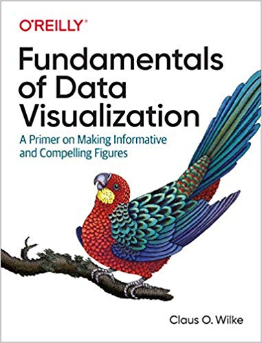

```{r setup, include=FALSE}
knitr::opts_chunk$set(echo = TRUE, comment = '#> ', warning=F, message=F,
                      cache=F)
library(tidyverse)
# source('https://raw.githubusercontent.com/EvaMaeRey/little_flipbooks_library/master/xaringan_reveal.R')
options(htmltools.dir.version = FALSE)
```

layout: true

<div class="my-header">
<span>BIOF339, Fall, 2019</span></div>


---
class: middle, center

# Why visualize data?

---

## Anscombe's data

.pull-left[
```{r, echo=F}
library(datasauRus)

d <- anscombe %>% 
  mutate(ID = 1:n()) %>% 
  tidyr::gather(variable, value, -ID) %>% 
  separate(variable, c('dim','data'), sep=1) %>%
  mutate(data = paste0('dataset', data)) %>%
  spread(dim, value) %>% 
  arrange(data)

ggplot(d, aes(x, y))+
  geom_point() + 
  facet_wrap(~data) + 
  theme_bw() +
  labs(caption = "Anscombe, 1973")
```

]
.pull-right[

| Statistic | Value |
|:----------|------:|
| `mean(x)` | 9 |
| `mean(y)` | 7.5 |
| `var(x)` | 11 | 
| `var(y)` | 4.13 | 
| `cor(x,y)` | 0.82 | 

]
---

## The [DataSaurus](https://www.autodeskresearch.com/publications/samestats) dozen

.pull-left[

```{r, echo=F}
 ggplot(datasaurus_dozen, aes(x=x, y=y, colour=dataset))+
    geom_point()+
    theme_void()+
    theme(legend.position = "none")+
    facet_wrap(~dataset, ncol=3)+
  labs(caption="Matejka & Fitzmaurice, 2017")
```


]
.pull-right[

| Statistic | Value |
|:----------|------:|
| `mean(x)` | 54.3 |
| `mean(y)` | 47.8 |
| `var(x)` | 281 | 
| `var(y)` | 725 | 
| `cor(x,y)` | -0.07 | 

]
---

## Bottom line

- Summary statistics cannot always distinguish datasets
- Take advantage of humans' ability to visually recognize and remember patterns
- Find discrepancies in the data more easily


---
class: middle, center

# Some examples

---
## Gallery

```{r, echo = F, fig.align='center'}
# install.packages('ggpubr')
library(ggpubr)
data("ToothGrowth")
df <- ToothGrowth
p <- ggboxplot(df, x = "dose", y = "len",
                color = "dose", palette =c("#00AFBB", "#E7B800", "#FC4E07"),
                add = "jitter", shape = "dose")
my_comparisons <- list( c("0.5", "1"), c("1", "2"), c("0.5", "2") )
p + stat_compare_means(comparisons = my_comparisons)+ # Add pairwise comparisons p-value
  stat_compare_means(label.y = 50)
detach('package:ggpubr')
```

???
This is a typical plot in scientific journals

---

## Gallery

```{r, echo = F, fig.align = 'center'}
# install.packages('cowplot')
library(cowplot)
p1 <- ggplot(iris, aes(Sepal.Length, Sepal.Width, color = Species)) + 
  geom_point() + facet_grid(. ~ Species) + stat_smooth(method = "lm") +
  background_grid(major = 'y', minor = "none") + 
  panel_border() + theme(legend.position = "none")

# plot B
p2 <- ggplot(iris, aes(Sepal.Length, fill = Species)) +
  geom_density(alpha = .7) + theme(legend.justification = "top")
p2a <- p2 + theme(legend.position = "none")

# plot C
p3 <- ggplot(iris, aes(Sepal.Width, fill = Species)) +
  geom_density(alpha = .7) + theme(legend.position = "none")

# legend
legend <- get_legend(p2)

# align all plots vertically
plots <- align_plots(p1, p2a, p3, align = 'v', axis = 'l')

# put together bottom row and then everything
bottom_row <- plot_grid(plots[[2]], plots[[3]], legend, labels = c("B", "C"), rel_widths = c(1, 1, .3), nrow = 1)
plot_grid(plots[[1]], bottom_row, labels = c("A"), ncol = 1)

detach('package:cowplot')
```

???
We can put ggplot figures together in a panel with some annotations very easily
using the cowplot package.

These graphs can be cleaned up some.

---

## Gallery

```{r, echo = F, fig.align="center"}
# library
library(ggridges)
library(ggplot2)
 

# basic example
ggplot(diamonds, aes(x = price, y = cut, fill = cut)) +
  geom_density_ridges() +
  theme_ridges() + 
  theme(legend.position = "none")
```

???
This is a plot of the diamonds dataset that comes with ggplot2

---

## Gallery

### Manhattan plot
```{r, echo = F, fig.align="center", out.height = "500px", out.width="600px", message = F}
library(qqman)
manhattan(gwasResults, annotatePval = 0.01)

detach('package:qqman')
```

???
Manhattan plots are often used in GWAS studies. You can customize the annotations and
the line for the significance levels

---

## Gallery

### Circular Manhattan plot

```{r cmplot, include=F}
#install.packages('CMplot')
library(CMplot)
data(pig60K)
CMplot(pig60K, plot.type="c", chr.labels=paste("Chr",c(1:18,"X"),sep=""), r=0.4, cir.legend=TRUE,
        outward=FALSE, cir.legend.col="black", cir.chr.h=1.3 ,chr.den.col="black", file="jpg",
        memo="", dpi=300)
detach('package:CMplot')
```


```{r, echo=F, out.height="500", out.width="500"}
knitr::include_graphics('Circular-Manhattan.trait1.trait2.trait3.jpg')
```


???
This gives a different representation of the manhattan plot. This example looks at three traits simultaneously

---

## Gallery

### Maps

```{r, echo = F}
library(choroplethr)
data(df_pop_county)
county_choropleth(df_pop_county,
                  title="US 2012 County Population Estimates",
                  legend = "Population")
detach('package:choroplethr')
```

---

### Interactive graphs

```{r,  echo=F, eval=T}
library(plotly)
library(fs)
library(here)
p=ggplot(iris, 
         aes(x=Sepal.Length, y=Sepal.Width, color=Species, shape=Species)) + 
  geom_point(size=2, alpha=0.6)+
  theme_bw()

mytext=paste("Sepal Length = ", iris$Sepal.Length, "\n" , "Sepal Width = ", iris$Sepal.Width, "\n", "Row Number: ",rownames(iris),  sep="")    
pp=plotly_build(p)   
style( pp, text=mytext, hoverinfo = "text", traces = c(1, 2, 3) )
pg <- ggplotly(p)
# htmltools::save_html(pg, file = here::here('slides','lectures','05-Plotting_files','pl.html'))
```

<!---<iframe src="05-Plotting_files/pl.html" width="1200" height="500" scrolling="yes" seamless="seamless" frameBorder="0"> </iframe> --->

???
These graphs are clickable. For example, click on a symbol on the legend, or drag your mouse over a region with left button held down. 

---

## Animated graphs

```{r aniplot, eval=T, echo=F, results='hide'}
library(ggplot2)
library(gganimate)
theme_set(theme_bw())

library(gapminder)
p <- ggplot(
  gapminder, 
  aes(x = gdpPercap, y=lifeExp, size = pop, colour = country)
  ) +
  geom_point(show.legend = FALSE, alpha = 0.7) +
  scale_color_viridis_d() +
  scale_size(range = c(2, 12)) +
  scale_x_log10() +
  labs(x = "GDP per capita", y = "Life expectancy")
p <- p + transition_time(year) +
  labs(title = "Year: {frame_time}")
animate(p, renderer = gifski_renderer(), device='png')
anim_save('img/anim.gif')
```


---
class: middle, center

# Data visualization with ggplot2


---
## What is ggplot2?

- A second (and final) iteration of the ggplot
- Implementation of Wilkerson's Grammar of Graphics in R
- Conceptually, a way to layer different elements onto a canvas to create a data visualization
- Started as Dr. Hadley Wickham's PhD thesis (with Dr. Dianne Cook)
- Won the John M. Chambers Statistical Software Award in 2006

- Mimicked in other software platforms
  - `ggplot` and `seaborn` in Python
  - Translated in `plotly`

---

## ggplot2 uses the __grammar__ of __graphics__

.pull-left[
### A grammar ...

- compose and re-use small parts
- build complex structures from simpler units

]

--

.pull-right[
### of graphics ...

- Think of yourself as a painter
- Build a visualization  using layers on a canvas
- Draw layers on top of each other
]

---

## Introduction to ggplot2

The `ggplot2` package is a very flexible and (to me) intuitive way of visualizing data.
It is based on the concept of layering elements on a canvas.

> This idea of layering graphics on a canvas is, to me, a nice way of building graphs

You need:

+ A `data.frame` object
+ _Aesthetic mappings_ (aes) to say what data is used for what purpose in the viz
    + x- and y-direction
    + shapes, colors, lines
+ A _geometry object_ (geom) to say what to draw
    + You can "layer" geoms on each other to build plots
    
---

## Introduction to ggplot2

`ggplot` used pipes before pipes were a thing. 

However, it uses the `+` symbol for
piping rather than the `%>%` operator, since it pre-dates the `tidyverse`

???
Emphasize that ggplot uses the + sign for piping, while the rest of the tidyverse uses the %>% symbol

---

## Introduction to ggplot2

```{r, eval=F}
library(ggplot2)
ggplot(mtcars, aes(x = wt, y = mpg)) + geom_point()
```

+ A `data.frame` object: mtcars
+ Aesthetic mapping: 
    - x-axis: wt
    - y-axis: mpg
+ Geometry:
    + geom_point: draw points

---

## Introduction to ggplot2
```{r, eval=F}
library(ggplot2)
ggplot(mtcars, aes(x = wt, y = mpg)) + geom_point()+ geom_smooth()
```

+ A `data.frame` object: mtcars
+ Aesthetic mapping: 
    - x-axis: wt
    - y-axis: mpg
+ Geometry:
    + geom_point: draw points
    + geom_smooth: Add a layer which draws a best-fitting line

---

## A dataset

We will use the [beaches](data/sydneybeaches3.csv) dataset

```{r, echo = T, message = F}
library(tidyverse)
library(rio)
beaches <- import('data/sydneybeaches3.csv')
```
```{r, echo = F}
head(beaches)
```

<p align="right" style="font-size: 10pt;">Credit: D. J. Navarro</p>

---
class: middle, center

# Building a graph

---

.pull-left[
### Start with a blank canvas

```{r gr2, eval=F}
ggplot()
```
]
.pull-right[

### 

```{r, ref.label='gr2', eval=T, echo = F}

```

]

---

.pull-left[
### Add a data set

```{r gr3, eval=F}
ggplot(
  data = beaches #<<
)
```
]
.pull-right[

### 

```{r, ref.label='gr3', eval=T, echo = F}

```

]

---

.pull-left[
### Add a mapping from data to elements

```{r gr4, eval=F}
ggplot(
  data = beaches,
  mapping = aes( #<<
    x = temperature, #<<
    y = rainfall #<<
  )
)
```

What goes in 

- the x and y axes
- the color of markers
- the shape of markers
]
.pull-right[

### 

```{r, ref.label='gr4', eval=T, echo = F}

```

]

???
This sets the axes up on the canvas

---

.pull-left[
### Add a geometry to draw

```{r gr5, eval=F}
ggplot(
  data = beaches,
  mapping = aes(
    x = temperature,
    y = rainfall
  )
) +
  geom_point() #<<
```

What to draw:

- Points, lines
- histogram, bars, pies
]
.pull-right[

### 

```{r, ref.label='gr5', eval=T, echo = F}

```

]

???

Now we tell it how to represent the data that is being mapped to the canvas. Here its points

---

.pull-left[
### Add options for the geom

```{r gr6, eval=F}
ggplot(
  data = beaches,
  mapping = aes(
    x = temperature,
    y = rainfall
  )
) +
  geom_point(size = 4) #<<
```


]
.pull-right[

### 

```{r, ref.label='gr6', eval=T, echo = F}

```

]

---

.pull-left[
### Add a mapping to modify the geom

```{r gr7, eval=F}
ggplot(
  data = beaches,
  mapping = aes(
    x = temperature,
    y = rainfall
  )
) +
  geom_point(
    mapping = aes(color = season_name), #<<
    size = 4
  )
```

> Anything data-driven has to be a mapping, driven by the `aes` function

]
.pull-right[

### 

```{r, ref.label='gr7', eval=T, echo = F}

```

]

---

.pull-left[
### Split into facets

```{r gr8, eval=F}
ggplot(
  data = beaches,
  mapping = aes(
    x = temperature,
    y = rainfall
  )
) +
  geom_point(
    mapping = aes(color = season_name),
    size = 4
  ) +
  facet_wrap( ~ season_name) #<<
```

]
.pull-right[

### 

```{r, ref.label='gr8', eval=T, echo = F}

```

]

---

.pull-left[
### Remove the legend

```{r gr9, eval=F}
ggplot(
  data = beaches,
  mapping = aes(
    x = temperature,
    y = rainfall
  )
) +
  geom_point(
    mapping = aes(color = season_name),
    size = 4,
    show.legend = FALSE #<<
  ) +
  facet_wrap( ~ season_name) 
```

]
.pull-right[

### 

```{r, ref.label='gr9', eval=T, echo = F}

```

]

---

.pull-left[
### Change the background

```{r gr10, eval=F}
ggplot(
  data = beaches,
  mapping = aes(
    x = temperature,
    y = rainfall
  )
) +
  geom_point(
    mapping = aes(color = season_name),
    size = 4,
    show.legend = FALSE
  ) +
  facet_wrap( ~ season_name) +
  theme_bw() #<<
```

]
.pull-right[

### 

```{r, ref.label='gr10', eval=T, echo = F}

```

]

---

.pull-left[
### Update the labels

```{r gr11, eval=F}
ggplot(
  data = beaches,
  mapping = aes(
    x = temperature,
    y = rainfall
  )
) +
  geom_point(
    mapping = aes(color = season_name),
    size = 4,
    show.legend = FALSE
  ) +
  facet_wrap( ~ season_name) +
  theme_bw() +
  labs(x = 'Temperature (C)', y = 'Rainfall (mm)') #<<
```

]
.pull-right[

### 

```{r, ref.label='gr11', eval=T, echo = F}

```

]

---

.pull-left[
### Add titles

```{r gr12, eval=F}
ggplot(
  data = beaches,
  mapping = aes(
    x = temperature,
    y = rainfall
  )
) +
  geom_point(
    mapping = aes(color = season_name),
    size = 4,
    show.legend = FALSE
  ) +
  facet_wrap( ~ season_name) +
  theme_bw() +
  labs(x = 'Temperature (C)', 
       y = 'Rainfall (mm)',
       title = 'Sydney weather by season', #<<
       subtitle = "Data from 2013 to 2018") #<<
```

]
.pull-right[

### 

```{r, ref.label='gr12', eval=T, echo = F}

```

]

---

## The grammar

- Data
- Aesthetics (or aesthetic mappings)
- Geometries (as layers) or Statistics (as computed layers)
- Facets
- Themes
- (Coordinates)
- (Scales)

---
class: middle, center

# Peeking under the hood

---
.pull-left[
### If I write...

```{r, eval = F, echo = T}
ggplot(
  data = beaches,
  aes(x = temperature,
      y = rainfall)
) + 
  geom_point()
```

]
--
.pull-right[
### what's really run is ...

```{r,echo = T, eval = F}
ggplot(
  data = beaches, 
  mapping = aes(
    x = temperature, y = rainfall)) + 
layer(
  geom = "point",
  stat = "identity",
  position = "identity") + 
facet_null() +
theme_grey() + 
coord_cartesian() + 
scale_x_continuous() + 
scale_y_continuous()
```

]

--

### Each element can be adapted and tweaked to create graphs

---

.pull-left[
### Customize

```{r gr13, eval=F}
ggplot(
  data = beaches,
  mapping = aes(
    x = temperature,
    y = rainfall
  )
) +
  geom_point(
    mapping = aes(color = season_name),
    size = 4,
    show.legend = FALSE
  ) +
  facet_wrap( ~ season_name) +
  theme_bw() +
  labs(x = 'Temperature (C)', 
       y = 'Rainfall (mm)',
       title = 'Sydney weather by season', 
       subtitle = "Data from 2013 to 2018") +
  theme(axis.title = element_text(size = 14), #<<
        axis.text = element_text(size = 12), #<<
        strip.text = element_text(size = 12)) #<<
```

]
.pull-right[

### 

```{r, ref.label='gr13', eval=T, echo = F}

```

]

---

## Using the BRCA data

We'll use the brca data developed during the homework. The RDS file is available [here](data/brca.rds). 

```{r}
brca_clean <- readRDS('data/brca.rds')
brca_clean <- brca_clean %>% 
  rename('Age' = 'Age.at.Initial.Pathologic.Diagnosis')

```

---

## Univariate plots

.pull-left[
```{r u1, eval = F, echo = T}
ggplot(data=brca_clean,
       mapping = aes(x = Age)) + 
  geom_histogram()
```
]
.pull-right[
```{r, eval=T, echo = F, ref.label="u1"}
```
]

---

## Univariate plots

.pull-left[
```{r u2, eval = F, echo = T}
ggplot(data=brca_clean,
       mapping = aes(x = Age)) + 
  geom_histogram(bins=50)
```
]
.pull-right[
```{r, eval=T, echo = F, ref.label="u2"}
```
]

---

## Univariate plots

.pull-left[
```{r u22, eval = F, echo = T}
ggplot(data=brca_clean,
       mapping = aes(x = Age)) + 
  geom_density()
```
]
.pull-right[
```{r, eval=T, echo = F, ref.label="u22"}
```
]

???

A smoother representation of the distribution
---

## Univariate plots

.pull-left[
```{r u3, eval = F, echo = T}
ggplot(data = brca_clean,
       mapping = aes(x = Tumor)) + 
  geom_bar()
```
]
.pull-right[
```{r, eval=T, echo = F, ref.label="u3"}
```
]

---
class: middle, center

# Bivariate plots

---

## Continuous with discrete

.pull-left[
```{r u4, eval = F, echo = T}
ggplot(data = brca_clean,
       mapping = aes(x = brca_cat, # Put discrete on x-axis
                     y = Age)
       ) + 
  geom_boxplot()
```
]
.pull-right[
```{r, eval=T, echo = F, ref.label="u4"}
```
]

???
A boxplot gives a 5 number summary of the data

---

## Continuous with discrete

.pull-left[
```{r u5, eval = F, echo = T}
ggplot(data = brca_clean,
       mapping = aes(x = brca_cat, # Put discrete on x-axis
                     y = Age)
       ) + 
  geom_violin()
```
]
.pull-right[
```{r, eval=T, echo = F, ref.label="u5"}
```
]

???

The violin plot gives more detail. It's essentially a reflected density plot

---

## Two continuous variables

.pull-left[
```{r u6, eval = F, echo = T}
ggplot(data=mpg,
       mapping = aes(x = displ,
                     y = cty)
       ) + 
  geom_point() 
```
]
.pull-right[
```{r, eval=T, echo = F, ref.label="u6"}
```
]

---

## Two continuous variables

.pull-left[
```{r u7, eval = F, echo = T}
ggplot(data=mpg,
       mapping = aes(x = displ,
                     y = cty)
       ) + 
  geom_point() + geom_smooth()
```
]
.pull-right[
```{r, eval=T, echo = F, ref.label="u7"}
```
]
---

## Two continuous variables

.pull-left[
```{r u8, eval = F, echo = T}
ggplot(data=mpg,
       mapping = aes(x = displ,
                     y = cty)
       ) + 
  geom_point() + geom_smooth(method='lm')
```

This forces a straight line.

`lm` stands for **linear model**

]
.pull-right[
```{r, eval=T, echo = F, ref.label="u8"}
```
]

---

## Adding layers

.pull-left[
```{r u9, eval = F, echo = T}
ggplot(data = mpg,
       aes(x = displ,
           y = cty,
           color = factor(cyl)))+
  geom_point()
```
]
.pull-right[
```{r, eval=T, echo = F, ref.label="u9"}
```
]
---

## Adding layers

.pull-left[
```{r u10, eval = F, echo = T}
ggplot(data = mpg,
       aes(x = displ,
           y = cty,
           color = factor(cyl)))+
  geom_point() +
  geom_smooth(se = F)
```

Separate lines for separate groups

`se=F` suppresses the confidence bands
]
.pull-right[
```{r, eval=T, echo = F, ref.label="u10"}
```
]

???

Confidence bands get messy with more things on the canvas

---

## Classwork checkin

What would happen if I tried to do the previous graph without transforming `cyl` to `factor`?


---

## Adding layers

.pull-left[
```{r u11, eval = F, echo = T}
ggplot(data = mpg,
       aes(x = displ,
           y = cty))+
  geom_point(aes(color=factor(cyl))) + #<<
  geom_smooth(aes(color=factor(cyl)), se=F) + #<<
  geom_smooth(color = 'black',se=F) #<<
```

+ You can limit mappings to particular geometries
+ Anything mapped from the original dataset has to be in `aes()`
+ Anything that doesn't come from the data can be on its own

]
.pull-right[
```{r, eval=T, echo = F, ref.label="u11"}
```
]

---

## Going back to the boxplots

.pull-left[
```{r v1, eval = F, echo = T}
ggplot(data = brca_clean,
       aes(x = brca_cat,
           y = Age)) +
  geom_boxplot() + 
  geom_point()
```

+ Can't see the points since they are overlayed
]
.pull-right[
```{r, eval=T, echo = F, ref.label="v1"}
```
]

---

## Going back to the boxplots

.pull-left[
```{r v2, eval = F, echo = T}

ggplot(data = brca_clean,
       aes(x = brca_cat,
           y = Age)) +
  geom_boxplot() + 
  geom_jitter()
```

+ Maybe too wide?
]
.pull-right[
```{r, eval=T, echo = F, ref.label="v2"}
```
]

---

## Going back to the boxplots

.pull-left[
```{r v3, eval = F, echo = T}

ggplot(data = brca_clean,
       aes(x = brca_cat,
           y = Age)) +
  geom_boxplot() + 
  geom_jitter(width = 0.3)
```


]
.pull-right[
```{r, eval=T, echo = F, ref.label="v3"}
```
]

---
class: middle, center

# Manhattan plots

---

## Manhattan plot
```{r manhattan, fig.width=8, message=F, warning=F}
library(qqman)
data(gwasResults)
head(gwasResults)
```
```{r }
gwasResults <- gwasResults %>% 
  mutate(x_position = 1:n())
head(gwasResults)
```

???
This is a summary of the results of a GWAS. `P` gives the nominal p-values

The function `n()` gives the number of observations in the current data set

I need x_position since CHR and BP recycle

---

## Manhattan plot

.pull-left[
```{r m1, fig.width=8, eval = F}
ggplot(gwasResults, 
       aes(x = x_position, 
           y = -log(P, base=10))
       )+
  geom_point(size = 0.2)
```
]
.pull-right[
```{r,eval=T, echo = F, ref.label="m1"}

```

]

???
We transform the p-values to -log~10~(p-value), and make the point size small

---

## Manhattan plot

.pull-left[
```{r m2, eval=F, fig.width=8}
ggplot(gwasResults, 
       aes(x = x_position, 
           y = -log(P, base=10),
           group=CHR, 
           color=CHR))+
  geom_point(size=0.2)
```

Oops!! We wanted points colored by chromosome. 

But that didn't happen because we put 
CHR in as numeric. 

Need to convert to factor, i.e., discrete
]
.pull-right[
```{r, eval=T, echo=F, ref.label="m2"}

```

]

???
Oops!! We wanted points colored by chromosome. But that didn't happen because we put
CHR in as numeric. Need to convert to factor, i.e., discrete

---

## Manhattan plot

.pull-left[
```{r m3, eval=F, fig.width=8}
ggplot(gwasResults, 
       aes(x = x_position, 
           y = -log(P, base=10),
           group=factor(CHR), #<<
           color=factor(CHR)))+ #<<
  geom_point(size=0.2)
```
]
.pull-right[
```{r, eval=T, echo=F, ref.label="m3"}

```

]

???

---

## Manhattan plot

.pull-left[
```{r m4, eval=F, fig.width=8}
ggplot(gwasResults, 
       aes(x = x_position, 
           y = -log(P, base=10),
           group=factor(CHR), color=factor(CHR)))+ 
  geom_point(size=0.2)+
  geom_hline(yintercept = 8, color='red', linetype=2) #<<
```
]
.pull-right[
```{r, eval=T, echo=F, ref.label='m4'}

```

]

---

## Manhattan plot, exploded

.pull-left[
```{r exploded, eval=F,fig.width=8}
ggplot(gwasResults, 
       aes(x = BP, #<<
           y = -log(P, base=10)))+#<<
  geom_point(size=0.2)+
  facet_wrap(~ CHR, nrow=4)+ #<<
  geom_hline(yintercept = 8, 
             color='red', 
             linetype=2)
```

+ No more grouping variable
+ A new function `facet_wrap`
]
.pull-right[
```{r, eval=T, echo=F, ref.label='exploded'}

```

]

---

## Resources

[](https://serialmentor.com/dataviz/index.html)
[](https://socviz.co/)
[](https://r-graphics.org/)

[Data visualization cheatsheet (RStudio)](https://github.com/rstudio/cheatsheets/blob/master/data-visualization-2.1.pdf)

[Chapter 3 of R4DS](https://r4ds.had.co.nz/data-visualisation.html)
